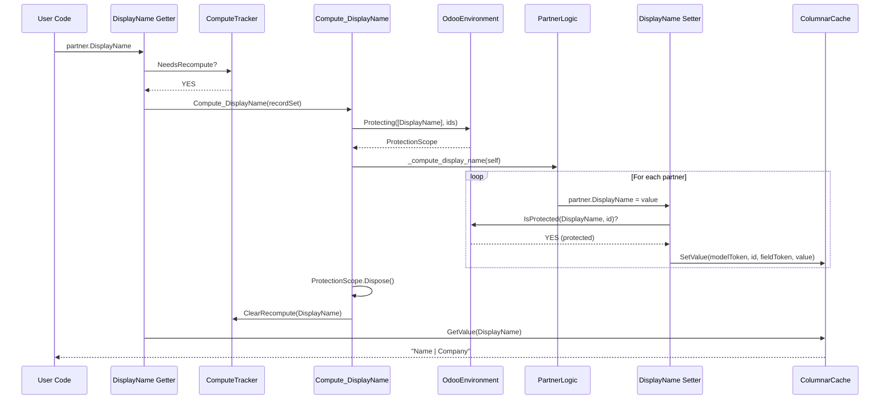

# Computed Field Protection Mechanism Design

## Problem Statement

The current `ComputeDisplayName` method in `PartnerLogic.cs` uses a complex, manual approach:

```csharp
[OdooLogic("res.partner", "_compute_display_name")]
public static void ComputeDisplayName(RecordSet<IPartnerBase> self)
{
    foreach (var partner in self)
    {
        var displayName = partner.IsCompany ? $"{name} | Company" : name;
        
        // Complex workaround - manually computing hash codes
        SetDisplayNameValue(partner.Env, partner.Id, displayName);
    }
}

// Helper with duplicated hash algorithm
private static void SetDisplayNameValue(IEnvironment env, int recordId, string value)
{
    var modelToken = GetStableHashCode("res.partner");
    var fieldToken = GetStableHashCode("res.partner.display_name");
    env.SetComputedValue(new ModelHandle(modelToken), recordId, new FieldHandle(fieldToken), value);
}
```

### Why not just use `partner.DisplayName = displayName`?

Two issues prevent this:

1. **Interface only has getter**: `IPartnerBase.DisplayName { get; }` has no setter
2. **Infinite recursion**: Even with a setter, it would call Write pipeline → Modified() → trigger recomputation → setter again → ∞

### Why not use `ModelSchema.ResPartner.DisplayName` directly?

The `ModelSchema` IS available in each assembly (generated per-assembly). The current code avoids it due to fear of cross-assembly issues, but this is unnecessary - each addon assembly has its own `ModelSchema.g.cs` with the correct tokens.

## Solution: Odoo's Protection Pattern

Odoo Python solves this elegantly with a "protection" mechanism (see `odoo/orm/fields.py`):

```python
# In Field.__set__()
def __set__(self, records, value):
    protected_ids = []
    
    for record_id in records._ids:
        if record_id in records.env._protected.get(self, ()):
            protected_ids.append(record_id)  # Write directly
        else:
            other_ids.append(record_id)      # Go through write()
    
    if protected_ids:
        # Protected path: direct cache write, no business logic
        self.write(protected_records, value)
```

The compute method is wrapped with `env.protecting(fields, records)`:

```python
# In recompute()
with env.protecting(field.base_field.dependent_fields, records):
    field.compute_value(records)
```

## C# Implementation Design

### 1. Add Protection Tracking to `OdooEnvironment`

```csharp
// src/Odoo.Core/OdooEnvironment.cs

public class OdooEnvironment : IEnvironment
{
    // Existing fields...
    
    /// <summary>
    /// Protection tracking: Field → Set of protected record IDs.
    /// Protected records can have computed field setters write directly to cache.
    /// </summary>
    private readonly Dictionary<FieldHandle, HashSet<int>> _protected = new();

    /// <summary>
    /// Check if a record is currently protected for a specific field.
    /// During protection, setters bypass Write pipeline and write directly to cache.
    /// </summary>
    /// <param name="field">The field handle</param>
    /// <param name="recordId">The record ID</param>
    /// <returns>True if protected, false otherwise</returns>
    public bool IsProtected(FieldHandle field, int recordId)
    {
        return _protected.TryGetValue(field, out var ids) && ids.Contains(recordId);
    }

    /// <summary>
    /// Protect records for specific fields during computation.
    /// Returns an IDisposable scope that removes protection on dispose.
    /// Mirrors Odoo's env.protecting(fields, records) context manager.
    /// </summary>
    /// <param name="fields">Fields to protect</param>
    /// <param name="recordIds">Record IDs to protect</param>
    /// <returns>Disposable scope that clears protection</returns>
    public IDisposable Protecting(IEnumerable<FieldHandle> fields, IEnumerable<int> recordIds)
    {
        var fieldList = fields.ToList();
        var idSet = recordIds.ToHashSet();
        
        foreach (var field in fieldList)
        {
            if (!_protected.TryGetValue(field, out var ids))
            {
                ids = new HashSet<int>();
                _protected[field] = ids;
            }
            ids.UnionWith(idSet);
        }
        
        return new ProtectionScope(this, fieldList, idSet);
    }

    private void ClearProtection(IEnumerable<FieldHandle> fields, IEnumerable<int> recordIds)
    {
        foreach (var field in fields)
        {
            if (_protected.TryGetValue(field, out var ids))
            {
                foreach (var id in recordIds)
                    ids.Remove(id);
            }
        }
    }

    private sealed class ProtectionScope : IDisposable
    {
        private readonly OdooEnvironment _env;
        private readonly List<FieldHandle> _fields;
        private readonly HashSet<int> _recordIds;
        
        public ProtectionScope(OdooEnvironment env, List<FieldHandle> fields, HashSet<int> recordIds)
        {
            _env = env;
            _fields = fields;
            _recordIds = recordIds;
        }
        
        public void Dispose()
        {
            _env.ClearProtection(_fields, _recordIds);
        }
    }
}
```

### 2. Update Interface Definition

Add setter to computed field in interface:

```csharp
// addons/base/Models/Partner.cs

[OdooField("display_name")]
[OdooCompute("_compute_display_name")]
[OdooDepends("name", "is_company")]
string DisplayName { get; set; }  // Changed from get-only to get/set
```

**Rationale**: Matches Odoo's pattern where all fields are syntactically assignable, but runtime validation determines if the write is valid.

### 3. Source Generator Changes

#### 3a. Computed Field Setter Generation

For computed fields, generate a setter with protection check:

```csharp
// Generated: ResPartner.g.cs

public string DisplayName
{
    get
    {
        // Check if recomputation needed (existing logic)
        if (Env is OdooEnvironment odooEnv && 
            odooEnv.ComputeTracker.NeedsRecompute(
                ModelSchema.ResPartner.ModelToken, Id, ModelSchema.ResPartner.DisplayName))
        {
            var recordSet = odooEnv.CreateRecordSet<Odoo.Base.Models.IPartnerBase>(new[] { Id });
            ResPartnerPipelines.Compute_DisplayName(recordSet);
        }
        return Env.Columns.GetValue<string>(
            ModelSchema.ResPartner.ModelToken, Id, ModelSchema.ResPartner.DisplayName);
    }
    set
    {
        // Check if this record is protected for this field (during computation)
        if (Env is OdooEnvironment odooEnv && 
            odooEnv.IsProtected(ModelSchema.ResPartner.DisplayName, Id))
        {
            // Protected path: direct cache write, no business logic
            // This is the path used during computation
            Env.Columns.SetValue(
                ModelSchema.ResPartner.ModelToken, 
                Id, 
                ModelSchema.ResPartner.DisplayName, 
                value);
        }
        else
        {
            // Not protected: computed field with no inverse cannot be written directly
            // TODO: Add support for [OdooInverse] attribute to enable editable computed fields
            throw new InvalidOperationException(
                $"Cannot directly write to computed field 'display_name' on res.partner. " +
                "This field is computed and has no inverse method defined. " +
                "Computed fields can only be set within their compute method.");
        }
    }
}
```

#### 3b. Compute Pipeline with Protection Wrapper

Modify generated `Compute_DisplayName` to wrap with protection:

```csharp
// Generated: ResPartnerPipelines.g.cs

/// <summary>
/// Trigger computation for DisplayName field using batch RecordSet pattern.
/// Wraps execution with protection to allow direct property assignment in compute method.
/// </summary>
public static void Compute_DisplayName(RecordSet<Odoo.Base.Models.IPartnerBase> self)
{
    if (self.Env is OdooEnvironment odooEnv)
    {
        // Wrap with protection - allows partner.DisplayName = value in compute method
        using (odooEnv.Protecting(
            new[] { ModelSchema.ResPartner.DisplayName }, 
            self.Ids))
        {
            // Call compute method via pipeline - module provides actual logic
            var pipeline = self.Env.GetPipeline<Action<RecordSet<Odoo.Base.Models.IPartnerBase>>>(
                "res.partner", "_compute_display_name");
            pipeline(self);
        }
        
        // Clear the needs-recompute flag for all records
        foreach (var id in self.Ids)
        {
            odooEnv.ComputeTracker.ClearRecompute(
                ModelSchema.ResPartner.ModelToken, id, ModelSchema.ResPartner.DisplayName);
        }
    }
    else
    {
        // Non-OdooEnvironment fallback (testing)
        var pipeline = self.Env.GetPipeline<Action<RecordSet<Odoo.Base.Models.IPartnerBase>>>(
            "res.partner", "_compute_display_name");
        pipeline(self);
    }
}
```

### 4. Simplified Module Code

With protection mechanism in place, `PartnerLogic.cs` becomes clean:

```csharp
// addons/base/Logic/PartnerLogic.cs

[OdooLogic("res.partner", "_compute_display_name")]
public static void ComputeDisplayName(RecordSet<IPartnerBase> self)
{
    Console.WriteLine($"[Compute] Computing display_name for {self.Count} partner(s)...");
    
    foreach (var partner in self)
    {
        var name = partner.Name ?? "";
        var displayName = partner.IsCompany 
            ? $"{name} | Company" 
            : name;
        
        // Clean Odoo-style assignment!
        // Works because Compute_DisplayName wraps this with protection
        partner.DisplayName = displayName;
        
        Console.WriteLine($"[Compute] Partner {partner.Id}: DisplayName = '{displayName}'");
    }
}
```

**Removed**: 
- `SetDisplayNameValue` helper method
- `GetStableHashCode` helper method
- Manual hash code computation
- Complex `SetComputedValue` call

## Flow Diagram



## Benefits

1. **Clean Odoo-style code**: `partner.DisplayName = value` works naturally
2. **Uses generated ModelSchema**: No manual hash computation needed
3. **Prevents infinite recursion**: Protection mechanism ensures direct cache write during computation
4. **Runtime safety**: Non-protected writes to computed fields throw clear errors
5. **Future-proof**: Easy to add `[OdooInverse]` support for editable computed fields

## Implementation Checklist

- [ ] Add `_protected` dictionary and `IsProtected()` method to `OdooEnvironment`
- [ ] Add `Protecting()` method returning `ProtectionScope` to `OdooEnvironment`
- [ ] Add `ProtectionScope` nested class implementing `IDisposable`
- [ ] Update `addons/base/Models/Partner.cs` - add setter to `DisplayName`
- [ ] Modify source generator to generate setters for computed fields with protection check
- [ ] Modify source generator to wrap `Compute_*` methods with `Protecting()`
- [ ] Simplify `PartnerLogic.ComputeDisplayName` to use direct assignment
- [ ] Remove `SetDisplayNameValue` and `GetStableHashCode` helper methods
- [ ] Add unit tests for protection mechanism

## Answering the Original Questions

### Q1: Why can't ComputeDisplayName just set `partner.DisplayName = displayName`?

**Before**: It couldn't because:
1. The interface `IPartnerBase.DisplayName` only had a getter
2. Even with a setter, it would trigger Write pipeline → Modified() → infinite recursion

**After this change**: It CAN use `partner.DisplayName = displayName` because:
1. Interface gets a setter
2. Generated setter checks if record is protected
3. `Compute_DisplayName` pipeline wraps execution with protection
4. During protection, setter writes directly to cache

### Q2: Why doesn't it use `ModelSchema.ResPartner.DisplayName`?

**Before**: Unnecessary caution about cross-assembly access. Each assembly has its own generated `ModelSchema.g.cs`.

**After this change**: The generated setter uses `ModelSchema.ResPartner.DisplayName` correctly. The module code (`PartnerLogic.cs`) doesn't even need to reference `ModelSchema` because it just uses `partner.DisplayName = value`, letting the generated code handle the details.