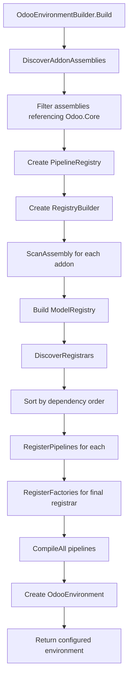

# OdooEnvironmentBuilder Architecture Plan

## Overview

This document describes the refactoring of `CreateConfiguredEnvironment` logic from test code into a reusable `OdooEnvironmentBuilder` class in `Odoo.Core`.

## Goals

1. **Simplify environment setup**: Single builder class encapsulates all initialization logic
2. **Auto-discovery**: Automatically find and register all `IModuleRegistrar` implementations from loaded assemblies
3. **Static compilation approach**: No dynamic assembly loading at runtime - all addons are compiled into the application
4. **Enable sidecar project**: Future tool will recompile the solution when addons are installed/removed

## Design

### OdooEnvironmentBuilder Class

Location: `src/Odoo.Core/OdooEnvironmentBuilder.cs`

```csharp
namespace Odoo.Core
{
    /// <summary>
    /// Builder for creating fully configured OdooEnvironment instances.
    /// Auto-discovers IModuleRegistrar implementations from loaded assemblies.
    /// 
    /// Usage:
    ///   var env = new OdooEnvironmentBuilder()
    ///       .WithUserId(1)
    ///       .Build();
    /// </summary>
    public class OdooEnvironmentBuilder
    {
        private int _userId = 1;
        private IColumnarCache? _cache;
        private readonly List<Assembly> _additionalAssemblies = new();
        
        /// <summary>
        /// Set the user ID for the environment.
        /// </summary>
        public OdooEnvironmentBuilder WithUserId(int userId)
        {
            _userId = userId;
            return this;
        }
        
        /// <summary>
        /// Use a custom cache implementation.
        /// </summary>
        public OdooEnvironmentBuilder WithCache(IColumnarCache cache)
        {
            _cache = cache;
            return this;
        }
        
        /// <summary>
        /// Add additional assemblies to scan (beyond auto-discovered ones).
        /// Useful for testing or special scenarios.
        /// </summary>
        public OdooEnvironmentBuilder AddAssembly(Assembly assembly)
        {
            _additionalAssemblies.Add(assembly);
            return this;
        }
        
        /// <summary>
        /// Build the configured OdooEnvironment.
        /// 
        /// This method:
        /// 1. Discovers all assemblies referencing Odoo.Core
        /// 2. Finds IModuleRegistrar implementations
        /// 3. Scans for [OdooModel] interfaces
        /// 4. Registers pipelines and factories
        /// 5. Compiles pipelines
        /// 6. Returns configured environment
        /// </summary>
        public OdooEnvironment Build()
        {
            // 1. Discover addon assemblies
            var addonAssemblies = DiscoverAddonAssemblies();
            
            // 2. Create registries
            var pipelineRegistry = new PipelineRegistry();
            var registryBuilder = new RegistryBuilder();
            
            // 3. Scan assemblies for models
            foreach (var assembly in addonAssemblies)
            {
                registryBuilder.ScanAssembly(assembly);
            }
            var modelRegistry = registryBuilder.Build();
            
            // 4. Discover and invoke registrars
            var registrars = DiscoverRegistrars(addonAssemblies);
            foreach (var registrar in registrars)
            {
                registrar.RegisterPipelines(pipelineRegistry);
            }
            
            // Register factories (only the "final" registrar should do this)
            // The last registrar typically has the unified wrappers
            if (registrars.Count > 0)
            {
                registrars.Last().RegisterFactories(modelRegistry);
            }
            
            // 5. Compile pipelines
            pipelineRegistry.CompileAll();
            
            // 6. Create environment
            return new OdooEnvironment(
                _userId,
                _cache,
                modelRegistry,
                pipelineRegistry
            );
        }
        
        /// <summary>
        /// Discover all assemblies that are potential addon assemblies.
        /// These are assemblies that reference Odoo.Core.
        /// </summary>
        private List<Assembly> DiscoverAddonAssemblies()
        {
            var coreAssembly = typeof(OdooEnvironment).Assembly;
            var coreAssemblyName = coreAssembly.GetName().Name;
            
            var addonAssemblies = new List<Assembly>();
            
            // Get all loaded assemblies
            var loadedAssemblies = AppDomain.CurrentDomain.GetAssemblies();
            
            foreach (var assembly in loadedAssemblies)
            {
                // Skip system assemblies
                if (assembly.IsDynamic)
                    continue;
                
                var name = assembly.GetName().Name;
                if (name == null || name.StartsWith("System") || name.StartsWith("Microsoft"))
                    continue;
                
                // Check if this assembly references Odoo.Core
                var references = assembly.GetReferencedAssemblies();
                if (references.Any(r => r.Name == coreAssemblyName))
                {
                    addonAssemblies.Add(assembly);
                }
            }
            
            // Add any explicitly added assemblies
            addonAssemblies.AddRange(_additionalAssemblies);
            
            // Deduplicate
            return addonAssemblies.Distinct().ToList();
        }
        
        /// <summary>
        /// Find all IModuleRegistrar implementations in the given assemblies.
        /// Returns them in dependency order (base modules first).
        /// </summary>
        private List<IModuleRegistrar> DiscoverRegistrars(List<Assembly> assemblies)
        {
            var registrars = new List<(IModuleRegistrar Registrar, Assembly Assembly)>();
            
            foreach (var assembly in assemblies)
            {
                var registrarTypes = assembly.GetTypes()
                    .Where(t => !t.IsAbstract && 
                               !t.IsInterface && 
                               typeof(IModuleRegistrar).IsAssignableFrom(t));
                
                foreach (var type in registrarTypes)
                {
                    try
                    {
                        var registrar = (IModuleRegistrar)Activator.CreateInstance(type)!;
                        registrars.Add((registrar, assembly));
                    }
                    catch (Exception ex)
                    {
                        // Log but continue
                        Console.WriteLine($"[Builder] Failed to instantiate registrar {type.Name}: {ex.Message}");
                    }
                }
            }
            
            // TODO: Sort by dependency order using module manifests
            // For now, use assembly reference order as a heuristic
            return SortByDependencyOrder(registrars);
        }
        
        /// <summary>
        /// Sort registrars by dependency order.
        /// Assemblies that are referenced by others come first.
        /// </summary>
        private List<IModuleRegistrar> SortByDependencyOrder(
            List<(IModuleRegistrar Registrar, Assembly Assembly)> registrars)
        {
            // Build dependency graph based on assembly references
            var assemblyOrder = new Dictionary<string, int>();
            var assemblies = registrars.Select(r => r.Assembly).Distinct().ToList();
            
            // Simple topological sort: assemblies with fewer dependencies come first
            var sorted = assemblies
                .OrderBy(a => a.GetReferencedAssemblies()
                    .Count(r => assemblies.Any(other => other.GetName().Name == r.Name)))
                .ToList();
            
            for (int i = 0; i < sorted.Count; i++)
            {
                assemblyOrder[sorted[i].GetName().Name ?? ""] = i;
            }
            
            return registrars
                .OrderBy(r => assemblyOrder.GetValueOrDefault(r.Assembly.GetName().Name ?? "", int.MaxValue))
                .Select(r => r.Registrar)
                .ToList();
        }
    }
}
```

### Usage Example

**Before (test code):**
```csharp
private static OdooEnvironment CreateConfiguredEnvironment()
{
    var pipelineRegistry = new PipelineRegistry();
    var registryBuilder = new RegistryBuilder();
    
    registryBuilder.ScanAssembly(typeof(IPartnerBase).Assembly);
    registryBuilder.ScanAssembly(typeof(IPartnerSaleExtension).Assembly);
    registryBuilder.ScanAssembly(typeof(IPartnerPurchaseExtension).Assembly);
    var modelRegistry = registryBuilder.Build();
    
    var baseRegistrar = new OdooBase.ModuleRegistrar();
    baseRegistrar.RegisterPipelines(pipelineRegistry);
    
    var saleRegistrar = new OdooSale.ModuleRegistrar();
    saleRegistrar.RegisterPipelines(pipelineRegistry);
    
    var purchaseRegistrar = new OdooPurchase.ModuleRegistrar();
    purchaseRegistrar.RegisterPipelines(pipelineRegistry);
    
    var testRegistrar = new ModuleRegistrar();
    testRegistrar.RegisterPipelines(pipelineRegistry);
    testRegistrar.RegisterFactories(modelRegistry);
    
    pipelineRegistry.CompileAll();
    
    return new OdooEnvironment(userId: 1, null, modelRegistry, pipelineRegistry);
}
```

**After:**
```csharp
private static OdooEnvironment CreateConfiguredEnvironment()
{
    return new OdooEnvironmentBuilder()
        .WithUserId(1)
        .Build();
}
```

### Flow Diagram



## Static Compilation vs Dynamic Loading

### Why Static Compilation?

NetPy uses **static compilation** instead of Odoo's dynamic module loading for several reasons:

1. **Source Generator Compatibility**: The unified interfaces like `IResPartner` are generated at compile time. They need to see ALL addon interfaces to generate the complete "snowball" wrapper.

2. **Type Safety**: C# is statically typed. Dynamic loading would require runtime reflection and lose IntelliSense support.

3. **Performance**: Compiled pipelines with direct method calls (~3-5ns) vs reflection-based dispatch (~200ns).

4. **AOT Compatibility**: Static compilation works with Native AOT, trimming, and single-file publishing.

### Sidecar Project Concept

When addons need to be installed or removed, a **sidecar tool** will:

1. Update the solution file to add/remove addon project references
2. Regenerate project files with correct dependencies
3. Trigger a full recompilation of the solution
4. Restart the application to load the new assembly

This approach ensures:
- Source generators run and produce updated unified interfaces
- All type information is available at compile time
- No runtime assembly loading complexity

The sidecar project will be implemented separately and is out of scope for this refactoring.

## Implementation Tasks

### Task 1: Create OdooEnvironmentBuilder class
- Location: `src/Odoo.Core/OdooEnvironmentBuilder.cs`
- Implement auto-discovery of addon assemblies
- Implement registrar discovery and dependency ordering
- Implement the `Build()` method

### Task 2: Update test code
- Refactor `DiamondInheritanceTests.cs` to use `OdooEnvironmentBuilder`
- Verify all tests still pass

### Task 3: Update MODULARITY_ARCHITECTURE.md
- Add section on static compilation approach
- Document sidecar project concept
- Update runtime flow diagram
- Add OdooEnvironmentBuilder usage examples

### Task 4: Consider removing ModuleLoader
- The existing `ModuleLoader` class does dynamic assembly loading
- It may no longer be needed with the static compilation approach
- Consider deprecating or removing it

## Files to Modify

| File | Action |
|------|--------|
| `src/Odoo.Core/OdooEnvironmentBuilder.cs` | CREATE |
| `tests/Odoo.Tests/DiamondInheritanceTests.cs` | MODIFY |
| `docs/MODULARITY_ARCHITECTURE.md` | MODIFY |
| `src/Odoo.Core/Modules/ModuleLoader.cs` | CONSIDER REMOVAL |

## Testing

After implementation, verify:
1. All existing tests in `DiamondInheritanceTests.cs` pass
2. All existing tests in `PartnerUsageTests.cs` pass
3. Auto-discovery correctly finds all addon assemblies
4. Dependency ordering is correct (base before extensions)
5. Pipelines compile without errors