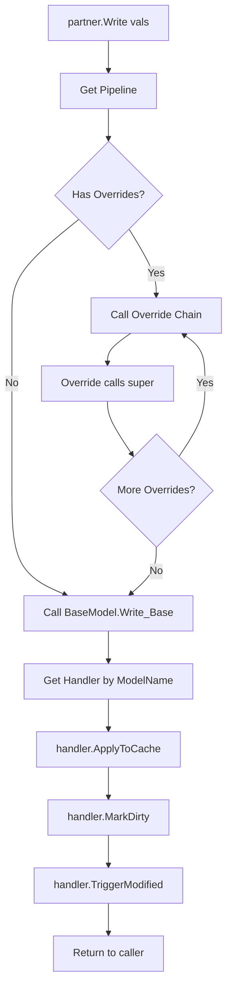

# IModel Interface Architecture

> **Status**: ✅ Implemented and tested (71 tests passing)

## Overview

This document describes the `IModel` interface pattern for NetPy, mirroring Odoo's abstract `Model` class. In Odoo, all models inherit from `models.Model` which provides ORM methods like `write`, `create`, `unlink`, `search`, and `read`. NetPy will follow the same pattern with an `IModel` interface.

## Goals

1. **Single source of truth**: ORM methods (`write`, `create`, `unlink`) defined once in `Odoo.Core`
2. **Pipeline-based extensibility**: All ORM methods go through pipelines for addon overrides
3. **Odoo compatibility**: Same API as Odoo (`partner.write({'name': 'New Name'})`)
4. **Type safety**: C# compile-time checking while maintaining flexibility
5. **No per-model code generation for base ORM logic**: Generated code only handles model-specific concerns

## Current State

Currently, `Write_Base` and `Create_Base` are generated per-model in `{Model}Pipelines.g.cs`:

```csharp
// Generated PER MODEL - code duplication!
public static void Write_Base(RecordHandle handle, IRecordValues values)
{
    var modelToken = ModelSchema.ResPartner.ModelToken;  // Model-specific
    if (values is ResPartnerValues typedValues)          // Model-specific type
    {
        ResPartnerValuesHandler.Instance.ApplyToCache(...);  // Model-specific handler
        ...
    }
}
```

**Problems**:
- Code duplication across all models
- Generated code bloat
- Base logic cannot be extended without regeneration

## Proposed Architecture

### 1. IModel Interface

```csharp
// src/Odoo.Core/OdooFramework.cs
namespace Odoo.Core
{
    /// <summary>
    /// Base interface for all Odoo model records.
    /// Provides ORM methods like write, search, browse.
    ///
    /// This mirrors Odoo's models.Model abstract class.
    /// Model interfaces should inherit from IModel:
    ///
    ///     [OdooModel("res.partner")]
    ///     public interface IPartnerBase : IModel { ... }
    /// </summary>
    public interface IModel : IOdooRecord
    {
        /// <summary>
        /// The technical model name (e.g., "res.partner").
        /// </summary>
        string ModelName { get; }
        
        /// <summary>
        /// Write values to this record.
        /// Calls the write pipeline for extensibility.
        /// </summary>
        /// <param name="vals">Values to write</param>
        /// <returns>True if successful</returns>
        bool Write(IRecordValues vals);
        
        /// <summary>
        /// Write values using a dictionary (Python interop).
        /// </summary>
        bool Write(IDictionary<string, object?> vals);
    }
    
    /// <summary>
    /// Extension methods for IModel providing Search and Browse.
    /// These return typed RecordSets for the specific model.
    /// </summary>
    public static class ModelExtensions
    {
        /// <summary>
        /// Search for records matching a domain.
        /// Returns a recordset of the same type.
        /// </summary>
        /// <example>
        /// var customers = partner.Search(new[] { ("is_customer", "=", true) });
        /// </example>
        public static RecordSet<T> Search<T>(this T self, SearchDomain domain)
            where T : class, IModel
        {
            // Implementation delegates to environment
            return self.Env.Search<T>(domain);
        }
        
        /// <summary>
        /// Browse records by IDs.
        /// Returns a recordset with the specified IDs.
        /// </summary>
        /// <example>
        /// var partners = partner.Browse(new[] { 1, 2, 3 });
        /// </example>
        public static RecordSet<T> Browse<T>(this T self, params int[] ids)
            where T : class, IModel
        {
            var recordIds = ids.Select(id => new RecordId(id)).ToArray();
            return self.Env.CreateRecordSet<T>(recordIds);
        }
        
        /// <summary>
        /// Browse a single record by ID.
        /// Returns a single record instance.
        /// </summary>
        public static T Browse<T>(this T self, int id)
            where T : class, IModel
        {
            var recordSet = self.Browse(id);
            return recordSet.FirstOrDefault
                ?? throw new InvalidOperationException($"Record {id} not found");
        }
    }
}
```

**Note**: `Unlink` and batch operations (`RecordSet.Write`, `RecordSet.Unlink`) will be added in a future iteration.

### 2. Non-Generic IRecordValuesHandler

Add a non-generic base interface for runtime handler lookup:

```csharp
// src/Odoo.Core/IRecordValuesHandler.cs
namespace Odoo.Core
{
    /// <summary>
    /// Non-generic base interface for values handlers.
    /// Enables runtime dispatch without knowing the concrete values type.
    /// </summary>
    public interface IRecordValuesHandler
    {
        /// <summary>
        /// Apply values to cache for a single record.
        /// </summary>
        void ApplyToCache(IRecordValues values, IColumnarCache cache, ModelHandle model, RecordId recordId);
        
        /// <summary>
        /// Mark set fields as dirty.
        /// </summary>
        void MarkDirty(IRecordValues values, IColumnarCache cache, ModelHandle model, RecordId recordId);
        
        /// <summary>
        /// Trigger field modification events for computed field recomputation.
        /// </summary>
        void TriggerModified(IRecordValues values, OdooEnvironment env, ModelHandle model, RecordId recordId);
        
        /// <summary>
        /// Convert dictionary to typed values.
        /// </summary>
        IRecordValues FromDictionary(Dictionary<string, object?> dict);
    }
    
    /// <summary>
    /// Generic interface for type-safe handler operations.
    /// </summary>
    public interface IRecordValuesHandler<TValues> : IRecordValuesHandler
        where TValues : IRecordValues
    {
        // Existing typed methods...
        void ApplyToCache(TValues values, IColumnarCache cache, ModelHandle model, RecordId recordId);
        // ... etc
    }
}
```

### 3. Handler Registry

Add handler registration and lookup to `OdooEnvironment`:

```csharp
// src/Odoo.Core/OdooEnvironment.cs
public class OdooEnvironment : IEnvironment
{
    // Handler registry: model name -> handler instance
    private readonly Dictionary<string, IRecordValuesHandler> _valueHandlers = new();
    
    /// <summary>
    /// Register a values handler for a model.
    /// Called by generated ModuleRegistrar.
    /// </summary>
    public void RegisterValuesHandler(string modelName, IRecordValuesHandler handler)
    {
        _valueHandlers[modelName] = handler;
    }
    
    /// <summary>
    /// Get the values handler for a model.
    /// </summary>
    public IRecordValuesHandler GetValuesHandler(string modelName)
    {
        if (_valueHandlers.TryGetValue(modelName, out var handler))
            return handler;
        throw new InvalidOperationException($"No values handler registered for model '{modelName}'");
    }
}
```

### 4. BaseModel Static Class

Single implementation of ORM base methods:

```csharp
// src/Odoo.Core/Logic/BaseModel.cs
namespace Odoo.Core.Logic
{
    /// <summary>
    /// Base ORM implementations for all models.
    /// These are registered as the default base for write/create/unlink pipelines.
    /// 
    /// This mirrors Odoo's BaseModel class with methods like write(), create(), unlink().
    /// </summary>
    public static class BaseModel
    {
        /// <summary>
        /// Base write implementation.
        /// Registered as default base for "{model}:write" pipeline.
        /// 
        /// 1. Gets handler from registry using values.ModelName
        /// 2. Applies values to columnar cache
        /// 3. Marks fields as dirty
        /// 4. Triggers computed field recomputation
        /// </summary>
        public static void Write_Base(RecordHandle handle, IRecordValues values)
        {
            var env = handle.Env as OdooEnvironment 
                ?? throw new InvalidOperationException("Write requires OdooEnvironment");
            
            var handler = env.GetValuesHandler(values.ModelName);
            
            // Apply values to cache
            handler.ApplyToCache(values, env.Columns, handle.Model, handle.Id);
            
            // Mark fields as dirty for flush
            handler.MarkDirty(values, env.Columns, handle.Model, handle.Id);
            
            // Trigger computed field recomputation
            handler.TriggerModified(values, env, handle.Model, handle.Id);
        }
        
        /// <summary>
        /// Base create implementation.
        /// Registered as default base for "{model}:create" pipeline.
        /// 
        /// 1. Generates new ID
        /// 2. Creates record instance via factory
        /// 3. Registers in identity map
        /// 4. Applies initial values
        /// </summary>
        public static IOdooRecord Create_Base(IEnvironment env, IRecordValues values)
        {
            var odooEnv = env as OdooEnvironment 
                ?? throw new InvalidOperationException("Create requires OdooEnvironment");
            
            var modelName = values.ModelName;
            
            // Generate new ID
            var newId = env.IdGenerator.NextId(modelName);
            
            // Get model token from schema
            var modelToken = odooEnv.GetModelToken(modelName);
            
            // Create handle
            var handle = new RecordHandle(env, newId, modelToken);
            
            // Create record instance via factory
            var record = odooEnv.CreateRecord(modelToken, newId);
            
            // Register in identity map
            odooEnv.RegisterInIdentityMap(modelToken, newId, record);
            
            // Apply initial values
            var handler = odooEnv.GetValuesHandler(modelName);
            handler.ApplyToCache(values, env.Columns, modelToken, newId);
            handler.MarkDirty(values, env.Columns, modelToken, newId);
            handler.TriggerModified(values, odooEnv, modelToken, newId);
            
            return record;
        }
        
        /// <summary>
        /// Base unlink implementation.
        /// Registered as default base for "{model}:unlink" pipeline.
        /// </summary>
        public static bool Unlink_Base(RecordHandle handle)
        {
            var env = handle.Env as OdooEnvironment 
                ?? throw new InvalidOperationException("Unlink requires OdooEnvironment");
            
            // Remove from identity map
            env.RemoveFromIdentityMap(handle.Model, handle.Id);
            
            // Mark for deletion (database layer will handle actual delete)
            env.MarkForDeletion(handle.Model, handle.Id);
            
            return true;
        }
    }
}
```

### 5. Generated Wrapper Updates

The source generator updates wrapper classes to implement `IModel`:

```csharp
// Generated: ResPartner.g.cs
public sealed class ResPartner : IResPartner, IModel, IRecordWrapper
{
    private readonly RecordHandle _handle;
    
    public RecordId Id => _handle.Id;
    public IEnvironment Env => _handle.Env;
    public RecordHandle Handle => _handle;
    
    // IModel implementation - calls pipeline
    public bool Write(IRecordValues vals)
    {
        var pipeline = Env.GetPipeline<Action<RecordHandle, IRecordValues>>(
            "res.partner", "write");
        pipeline(_handle, vals);
        return true;
    }
    
    public bool Write(IDictionary<string, object?> vals)
    {
        var handler = ((OdooEnvironment)Env).GetValuesHandler("res.partner");
        var typedVals = handler.FromDictionary(new Dictionary<string, object?>(vals));
        return Write(typedVals);
    }
    
    public bool Unlink()
    {
        var pipeline = Env.GetPipeline<Func<RecordHandle, bool>>(
            "res.partner", "unlink");
        return pipeline(_handle);
    }
    
    // ... existing property implementations ...
}
```

### 6. Generated Handler Updates

Handlers implement the non-generic interface:

```csharp
// Generated: ResPartnerValuesHandler.g.cs
public sealed class ResPartnerValuesHandler : 
    IRecordValuesHandler<ResPartnerValues>, 
    IRecordValuesHandler  // NEW: non-generic interface
{
    public static readonly ResPartnerValuesHandler Instance = new();
    
    // Typed implementation (existing)
    public void ApplyToCache(ResPartnerValues values, IColumnarCache cache, 
        ModelHandle model, RecordId recordId)
    {
        if (values.Name.IsSet)
            cache.SetValue<string>(model, recordId, ModelSchema.ResPartner.Name, values.Name.Value!);
        // ... etc
    }
    
    // Non-generic implementation (NEW) - for runtime dispatch
    void IRecordValuesHandler.ApplyToCache(IRecordValues values, IColumnarCache cache, 
        ModelHandle model, RecordId recordId)
    {
        if (values is ResPartnerValues typed)
        {
            ApplyToCache(typed, cache, model, recordId);
        }
        else
        {
            var converted = FromDictionary(values.ToDictionary());
            ApplyToCache((ResPartnerValues)converted, cache, model, recordId);
        }
    }
    
    // Non-generic FromDictionary (NEW)
    public IRecordValues FromDictionary(Dictionary<string, object?> dict)
    {
        return ResPartnerValues.FromDictionary(dict);
    }
    
    // ... similar for MarkDirty, TriggerModified ...
}
```

### 7. ModuleRegistrar Updates

Register handlers and use BaseModel as default:

```csharp
// Generated: ModuleRegistrar.g.cs
public class ModuleRegistrar : IModuleRegistrar
{
    public void RegisterPipelines(IPipelineBuilder builder)
    {
        // Register BaseModel as default base for ALL models
        // This is done once, not per-model
        builder.RegisterDefaultBase("*", "write",
            (Action<RecordHandle, IRecordValues>)BaseModel.Write_Base);
        builder.RegisterDefaultBase("*", "create",
            (Func<IEnvironment, IRecordValues, IOdooRecord>)BaseModel.Create_Base);
        // Note: unlink will be added in a future iteration
        
        // Model-specific overrides still work via pipeline
        // (existing override registrations from addons)
    }
    
    public void RegisterHandlers(OdooEnvironment env)
    {
        // Register values handlers
        env.RegisterValuesHandler("res.partner", ResPartnerValuesHandler.Instance);
    }
    
    public void RegisterFactories(ModelRegistry modelRegistry)
    {
        // Existing factory registration
        modelRegistry.RegisterFactory(ModelSchema.ResPartner.ModelToken, 
            (env, id) => new ResPartner(new RecordHandle(env, id, ModelSchema.ResPartner.ModelToken)));
    }
}
```

## Interface Hierarchy

```
                    ┌────────────────┐
                    │  IOdooRecord   │  (Id, Env)
                    └───────┬────────┘
                            │
                    ┌───────▼────────┐
                    │    IModel      │  (Write, Search, Browse)
                    └───────┬────────┘
                            │
           ┌────────────────┼────────────────┐
           ▼                ▼                ▼
    ┌─────────────┐  ┌─────────────┐  ┌──────────────┐
    │IPartnerBase │  │IPartnerSale │  │IPartnerPurch │
    │  - Name     │  │ Extension   │  │  Extension   │
    │  - Email    │  │ - IsCustomer│  │ - IsSupplier │
    └──────┬──────┘  └──────┬──────┘  └──────┬───────┘
           │                │                │
           └────────────────┴────────────────┘
                            │
                    ┌───────▼────────┐
                    │  IResPartner   │  (Unified interface)
                    └───────┬────────┘
                            │
                    ┌───────▼────────┐
                    │   ResPartner   │  (Generated class)
                    │ implements all │
                    └────────────────┘
```

## Usage Examples

### Python Shell (via proxies)

```python
>>> partner = env['res.partner'].browse(1)
>>> partner.write({'name': 'New Name', 'email': 'new@example.com'})
True
>>> # Search for customers
>>> customers = partner.search([('is_customer', '=', True)])
>>> len(customers)
5
```

### C# Code

```csharp
var env = new OdooEnvironmentBuilder().Build();
var partner = env.Create<IResPartner>(new ResPartnerValues { Name = "Test" });

// Write via IModel interface
partner.Write(new ResPartnerValues { Email = { Value = "test@example.com", IsSet = true } });

// Or via dictionary
partner.Write(new Dictionary<string, object?> { ["email"] = "test@example.com" });

// Search and Browse via extension methods
var customers = partner.Search(new SearchDomain().Where("is_customer", "=", true));
var specific = partner.Browse(1, 2, 3);  // Returns RecordSet<IResPartner>
var single = partner.Browse(42);         // Returns IResPartner
```

### Addon Override (Sale module)

```csharp
// addons/sale/Logic/PartnerLogic.cs
[OdooLogic("res.partner", "write")]
public static void Write_ValidateCreditLimit(
    RecordHandle handle,
    IPartnerSaleExtensionValues vals,  // Type-safe!
    Action<RecordHandle, IRecordValues> super)
{
    // Validate before write
    if (vals.CreditLimit.IsSet && vals.CreditLimit.Value < 0)
        throw new ValidationException("Credit limit cannot be negative!");
    
    // Call base (or previous override in chain)
    super(handle, vals);
}
```

## Pipeline Flow



## Implementation Tasks

| # | Task | Description | Files |
|---|------|-------------|-------|
| 1 | Add IModel interface | Add to IOdooRecord hierarchy with Write, ModelName | [`src/Odoo.Core/OdooFramework.cs`](src/Odoo.Core/OdooFramework.cs) |
| 2 | Add ModelExtensions | Search and Browse extension methods | [`src/Odoo.Core/OdooFramework.cs`](src/Odoo.Core/OdooFramework.cs) |
| 3 | Add non-generic IRecordValuesHandler | Base interface for runtime dispatch | [`src/Odoo.Core/IRecordValuesHandler.cs`](src/Odoo.Core/IRecordValuesHandler.cs) |
| 4 | Add handler registry to OdooEnvironment | RegisterValuesHandler, GetValuesHandler | [`src/Odoo.Core/OdooEnvironment.cs`](src/Odoo.Core/OdooEnvironment.cs) |
| 5 | Create BaseModel class | Write_Base, Create_Base | `src/Odoo.Core/Logic/BaseModel.cs` (NEW) |
| 6 | Update source generator - handlers | Implement non-generic interface | [`src/Odoo.SourceGenerator/OdooModelGenerator.cs`](src/Odoo.SourceGenerator/OdooModelGenerator.cs) |
| 7 | Update source generator - wrappers | Implement IModel, add Write/ModelName | [`src/Odoo.SourceGenerator/OdooModelGenerator.cs`](src/Odoo.SourceGenerator/OdooModelGenerator.cs) |
| 8 | Update source generator - registrar | Register handlers, use BaseModel defaults | [`src/Odoo.SourceGenerator/OdooModelGenerator.cs`](src/Odoo.SourceGenerator/OdooModelGenerator.cs) |
| 9 | Update model interfaces | Change `: IOdooRecord` to `: IModel` | [`addons/*/Models/*.cs`](addons/) |
| 10 | Update Python wrappers | Use IModel.Write instead of direct cache | [`src/Odoo.Python/Wrappers/OdooEnvironmentWrapper.cs`](src/Odoo.Python/Wrappers/OdooEnvironmentWrapper.cs) |
| 11 | Add tests | Test IModel.Write and pipeline flow | [`tests/Odoo.Tests/`](tests/Odoo.Tests/) |

## Migration Path

1. **Phase 1**: Add IModel interface and BaseModel (backwards compatible)
   - IModel extends IOdooRecord, so existing code works
   - BaseModel registered alongside per-model bases

2. **Phase 2**: Update generator to use BaseModel
   - Remove per-model Write_Base/Create_Base generation
   - Generate wrapper IModel implementation

3. **Phase 3**: Update model interfaces
   - Change from `: IOdooRecord` to `: IModel`
   - Verify all tests pass

4. **Phase 4**: Update Python wrappers
   - Change `RecordWrapper.Write()` to call `IModel.Write()`
   - Remove direct cache access

## Benefits

| Aspect | Before | After |
|--------|--------|-------|
| Code location | Generated per-model | Single BaseModel class |
| Extensibility | Regenerate all code | Modify BaseModel once |
| Type safety | Model-specific types | Generic + type dispatch |
| Python interop | Bypasses pipeline | Full pipeline support |
| Maintainability | N files (one per model) | 1 file (BaseModel) |

## Decisions Made

1. **Write return type**: Returns `bool` (like Odoo)
2. **Batch operations**: Deferred to future iteration (`RecordSet.Write`, `RecordSet.Unlink`)
3. **Unlink**: Deferred to future iteration
4. **Search/Browse**: Added as extension methods on `IModel` (enables `partner.Search(domain)`)

## Future Iterations

- `Unlink()` method on IModel
- `RecordSet<T>.Write(vals)` for batch writes
- `RecordSet<T>.Unlink()` for batch deletes
- `Read` method for explicit field loading