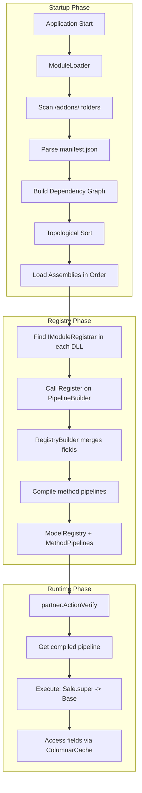
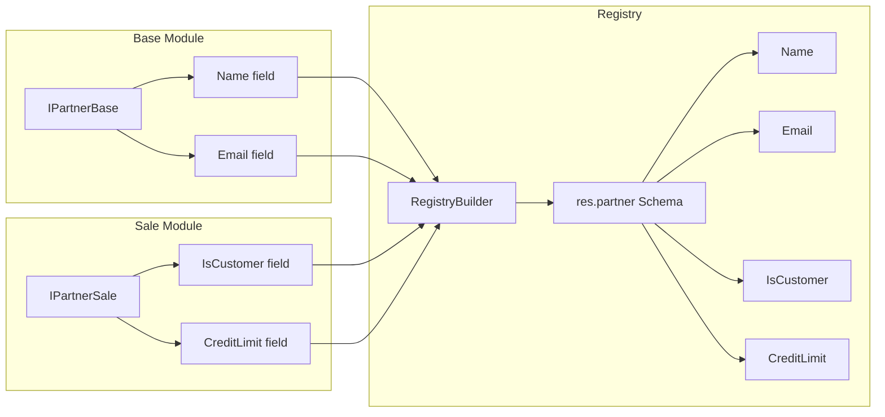
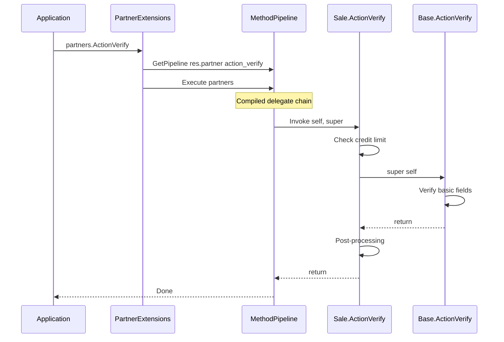
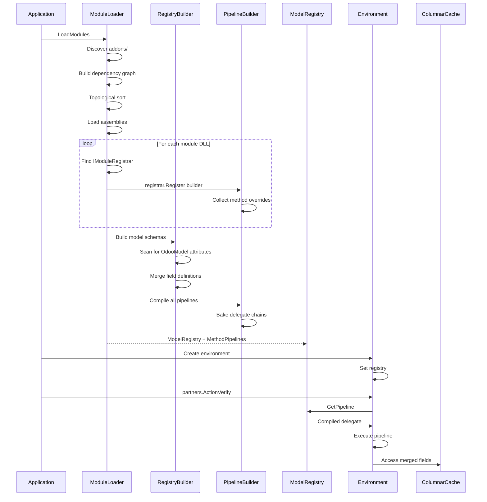

# Modularity Architecture - Compositional Registry with Method Pipeline

## Overview

This document describes the modular addon system for NetPy, adapted from Odoo's architecture. The system uses a **Middleware Pipeline** pattern (like ASP.NET Core) for high-performance method inheritance without recompiling.

**Key Capabilities:**
- **Module Discovery**: Automatic scanning of addon directories
- **Dependency Resolution**: Topological sorting based on module dependencies
- **Model Composition**: Merging model definitions from multiple modules (like Odoo's `_inherit`)
- **Method Pipeline**: Delegate chain with typed `super` for Odoo-like method overrides
- **Python Integration**: Support for both C# DLLs and Python modules

> **Note**: This implementation does NOT use WASI/WASM. It uses standard .NET `AssemblyLoadContext` for assembly isolation.

## Core Innovation: Typed Super Delegates

Instead of generic `Func<...>` or `Action<...>` signatures, the Source Generator creates **typed delegate aliases** for each method. This provides:

- **Better IntelliSense**: Hovering shows the actual method signature
- **Cleaner code**: `super` instead of `next`, typed delegates instead of generics  
- **Odoo familiarity**: Matches Python's `super().method()` pattern

**Performance Comparison:**
| Method | Latency | vs Python |
|--------|---------|-----------|
| Virtual Method - monolith | ~1-2ns | 100x faster |
| **Delegate Pipeline - our approach** | ~3-5ns per layer | **40x faster** |
| Reflection - Python/Dynamic | ~200+ns | baseline |

## Architecture Diagram



## Directory Structure

```
/project_root/
├── netpy.csproj                 # Main application
├── Core/                        # Framework core
├── Models/                      # Built-in model interfaces
├── addons/                      # Module directory
│   ├── base/                    # Core module
│   │   ├── manifest.json
│   │   ├── Models/
│   │   │   └── Partner.cs
│   │   ├── Logic/
│   │   │   └── PartnerLogic.cs
│   │   ├── bin/
│   │   │   └── Odoo.Base.dll
│   │   └── python/
│   │       └── base_extensions.py
│   │
│   ├── sale/                    # Sales module
│   │   ├── manifest.json        # depends: base
│   │   ├── Models/
│   │   │   └── PartnerExtension.cs
│   │   ├── Logic/
│   │   │   └── PartnerLogic.cs  # Overrides with super parameter
│   │   ├── bin/
│   │   │   └── Odoo.Sale.dll
│   │   └── python/
│   │       └── sale_workflow.py
```

## Component Design

### 1. ModuleManifest

```csharp
namespace Odoo.Core.Modules
{
    public record ModuleManifest
    {
        public string Name { get; init; } = "";
        public string Version { get; init; } = "1.0.0";
        public string[] Depends { get; init; } = Array.Empty<string>();
        public string[] AutoInstall { get; init; } = Array.Empty<string>();
        public string? AssemblyPath { get; init; }      // Relative: bin/Module.dll
        public string? PythonPath { get; init; }        // Relative: python/
        public string Description { get; init; } = "";
        public string Author { get; init; } = "";
        public string Category { get; init; } = "";
        public bool Installable { get; init; } = true;
        public bool Application { get; init; } = false;
    }
}
```

### 2. ModuleLoader

```csharp
namespace Odoo.Core.Modules
{
    public class ModuleLoader
    {
        private readonly string _addonsPath;
        private readonly AssemblyLoadContext _loadContext;
        
        public ModuleLoader(string addonsPath)
        {
            _addonsPath = addonsPath;
            _loadContext = new ModuleLoadContext(addonsPath);
        }
        
        // Discovery: Find all modules
        public Dictionary<string, ModuleManifest> DiscoverModules();
        
        // Resolution: Topological sort by dependencies
        public List<ModuleManifest> ResolveDependencies(
            Dictionary<string, ModuleManifest> modules);
        
        // Loading: Load assemblies in dependency order
        public List<LoadedModule> LoadModules();
    }
}
```

### 3. RegistryBuilder - Model Composition

The RegistryBuilder merges model definitions from multiple modules.



---

## Method Pipeline Architecture

### Generated Typed Super Delegates

The Source Generator scans base logic implementations and generates matching typed delegates:

**Input (Base Logic):**
```csharp
[OdooLogic("res.partner", "action_verify")]
public static void ActionVerify(RecordSet<IPartner> self) { ... }

[OdooLogic("res.partner", "create")]
public static RecordSet<IPartner> Create(
    RecordSet<IPartner> self, 
    Dictionary<string, object> values) { ... }
```

**Generated Output:** `Odoo.Generated.ResPartner.Super`
```csharp
namespace Odoo.Generated.ResPartner.Super
{
    /// <summary>Super delegate for action_verify - void method</summary>
    public delegate void ActionVerify(RecordSet<IPartner> self);

    /// <summary>Super delegate for create - returns RecordSet, takes values</summary>
    public delegate RecordSet<IPartner> Create(
        RecordSet<IPartner> self, 
        Dictionary<string, object> values);
    
    /// <summary>Super delegate for write - returns bool, takes values</summary>
    public delegate bool Write(
        RecordSet<IPartner> self, 
        Dictionary<string, object> values);
}
```

### The Developer Experience

**Module A (Base):** `addons/base/Logic/PartnerLogic.cs`
```csharp
// Base implementation - no 'super' parameter (bottom of chain)
[OdooLogic("res.partner", "action_verify")]
public static void ActionVerify(RecordSet<IPartner> self)
{
    Console.WriteLine("[Base] Verifying basic fields...");
    foreach (var partner in self)
    {
        if (string.IsNullOrEmpty(partner.Name)) 
            throw new ValidationException("Name required");
    }
}
```

**Module B (Sale):** `addons/sale/Logic/PartnerLogic.cs`
```csharp
using Odoo.Generated.ResPartner.Super;

// Override with typed 'super' parameter - clean and readable!
[OdooLogic("res.partner", "action_verify")]
public static void ActionVerify(
    RecordSet<IPartner> self, 
    ActionVerify super)  // <-- Typed delegate, not Action<RecordSet<IPartner>>
{
    Console.WriteLine("[Sale] Checking credit limit...");
    
    // Logic BEFORE super
    foreach (var partner in self)
    {
        if (partner.IsCustomer && partner.CreditLimit <= 0)
            throw new ValidationException("Credit limit required for customers");
    }

    // Call super() - exactly like Odoo Python!
    super(self);

    // Logic AFTER super
    Console.WriteLine("[Sale] Verification complete.");
}
```

### IDE Experience

When hovering over `super` in the Sale module:
```
(parameter) ActionVerify super
    delegate void ActionVerify(RecordSet<IPartner> self)
    
    Calls the next implementation in the method chain (base module).
```

vs. the generic approach (what we're avoiding):
```
(parameter) Action<RecordSet<IPartner>> next
    // No semantic meaning, just "some action that takes a recordset"
```

### New Attribute: OdooLogic

```csharp
namespace Odoo.Core
{
    /// <summary>
    /// Marks a method as business logic for a model.
    /// Source generator creates:
    /// 1. Typed Super delegate in Odoo.Generated.{Model}.Super namespace
    /// 2. Pipeline registration in IModuleRegistrar
    /// 3. Extension method on RecordSet for invocation
    /// </summary>
    [AttributeUsage(AttributeTargets.Method)]
    public class OdooLogicAttribute : Attribute
    {
        public string ModelName { get; }
        public string MethodName { get; }
        
        public OdooLogicAttribute(string modelName, string methodName)
        {
            ModelName = modelName;
            MethodName = methodName;
        }
    }
}
```

### Generated Registration Hook

The Source Generator creates this in each module DLL - **no runtime reflection needed**:

```csharp
// Generated/ModuleRegistration.cs in Sale.dll
namespace Odoo.Sale.Generated
{
    public class SaleModuleRegistration : IModuleRegistrar
    {
        public void Register(IPipelineBuilder builder)
        {
            builder.RegisterOverride(
                model: "res.partner", 
                method: "action_verify", 
                priority: 10, // From manifest dependency depth
                handler: (self, super) => PartnerLogic.ActionVerify(
                    (RecordSet<IPartner>)self, 
                    super)  // Typed delegate passed through
            );
        }
    }
}
```

### The Method Pipeline Runtime

```csharp
namespace Odoo.Core.Pipeline
{
    // Signature for base implementation (leaf node)
    public delegate void LogicHandler<T>(RecordSet<T> self) where T : IOdooRecord;
    
    // Signature for override (wrapper node) - uses 'super' naming
    public delegate void LogicWrapper<T>(
        RecordSet<T> self, 
        Action<RecordSet<T>> super) where T : IOdooRecord;

    public class MethodPipeline<T> where T : IOdooRecord
    {
        private Action<RecordSet<T>> _compiledChain;
        private readonly List<LogicWrapper<T>> _overrides = new();
        private LogicHandler<T> _baseImplementation;

        public void SetBase(LogicHandler<T> baseImpl) => _baseImplementation = baseImpl;
        public void AddOverride(LogicWrapper<T> wrapper) => _overrides.Add(wrapper);

        /// <summary>
        /// Bake the chain into a single delegate for fast execution.
        /// Called once at startup.
        /// </summary>
        public void Compile()
        {
            // Start with base implementation
            Action<RecordSet<T>> current = (records) => _baseImplementation(records);

            // Wrap in reverse order: if [Sale, Stock], we want Stock(Sale(Base))
            for (int i = _overrides.Count - 1; i >= 0; i--)
            {
                var wrapper = _overrides[i];
                var super = current; // Capture current 'super' pointer
                current = (records) => wrapper(records, super);
            }

            _compiledChain = current;
        }

        /// <summary>
        /// Fast execution - just a delegate invocation (~3-5ns)
        /// </summary>
        public void Execute(RecordSet<T> records) => _compiledChain(records);
    }
}
```

### Pipeline Execution Flow



### Generated RecordSet Extension

```csharp
// Generated for each model with [OdooLogic] methods
public static class PartnerExtensions
{
    public static void ActionVerify(this RecordSet<IPartner> self)
    {
        // Get pre-compiled pipeline from Environment
        var pipeline = self.Env.Methods
            .GetPipeline<IPartner>("res.partner", "action_verify");
        
        // Single delegate invocation (3-5ns overhead)
        pipeline.Execute(self);
    }
}
```

---

## Methods with Return Values

For methods returning values, the typed delegates make signatures crystal clear:

**Generated Super Delegate:**
```csharp
namespace Odoo.Generated.ResPartner.Super
{
    public delegate RecordSet<IPartner> Create(
        RecordSet<IPartner> self, 
        Dictionary<string, object> values);
}
```

**Base Implementation:**
```csharp
[OdooLogic("res.partner", "create")]
public static RecordSet<IPartner> Create(
    RecordSet<IPartner> self, 
    Dictionary<string, object> vals)
{
    // Insert into database, return new recordset with created IDs
    var newIds = DatabaseInsert(vals);
    return self.Env.Partners(newIds);
}
```

**Override with Typed Super:**
```csharp
using Odoo.Generated.ResPartner.Super;

[OdooLogic("res.partner", "create")]
public static RecordSet<IPartner> Create(
    RecordSet<IPartner> self, 
    Dictionary<string, object> vals,
    Create super)  // <-- Clean! Typed delegate, not Func<...,...,...>
{
    // Pre-processing
    vals["create_date"] = DateTime.UtcNow;
    
    // Call super and get result
    var created = super(self, vals);
    
    // Post-processing
    foreach (var partner in created)
        SendWelcomeEmail(partner.Id);
    
    return created;
}
```

---

## Model Override Example

### Base Module - Defines core Partner

```csharp
// In Odoo.Base.dll
namespace Odoo.Base.Models
{
    [OdooModel("res.partner")]
    public interface IPartnerBase : IOdooRecord
    {
        [OdooField("name")]
        string Name { get; set; }
        
        [OdooField("email")]
        string? Email { get; set; }
        
        [OdooField("is_company")]
        bool IsCompany { get; set; }
    }
}
```

### Sale Module - Extends Partner

```csharp
// In Odoo.Sale.dll - depends on Base
namespace Odoo.Sale.Models
{
    // Same model name = inheritance/extension
    [OdooModel("res.partner")]
    public interface IPartnerSaleExtension : IOdooRecord
    {
        [OdooField("is_customer")]
        bool IsCustomer { get; set; }
        
        [OdooField("credit_limit")]
        decimal CreditLimit { get; set; }
    }
}
```

### Result After Registry Merge

```
Model: res.partner
  Fields:
    - name (string, from IPartnerBase)
    - email (string?, from IPartnerBase)
    - is_company (bool, from IPartnerBase)
    - is_customer (bool, from IPartnerSaleExtension)  <- Added by sale module
    - credit_limit (decimal, from IPartnerSaleExtension)  <- Added by sale module
  
  Methods (compiled delegate chains):
    - action_verify: Sale.super -> Base
    - create: Sale.super -> Base (with return value)
```

---

## Runtime Flow



---

## Python Module Integration

### Manifest with Python

```json
{
    "name": "sale",
    "version": "1.0.0",
    "depends": ["base"],
    "assembly_path": "bin/Odoo.Sale.dll",
    "python_path": "python/",
    "description": "Sales management module"
}
```

### Python Extension Pattern

```python
# addons/sale/python/partner_extension.py

class PartnerExtension:
    """Python extension for res.partner model."""
    
    @staticmethod
    def compute_credit_score(env, partner_id):
        """Compute credit score using Python business logic."""
        return 750
    
    @staticmethod
    def send_marketing_email(env, partner_ids, template):
        """Batch operation defined in Python."""
        for pid in partner_ids:
            pass  # Send email logic
        return {'sent': len(partner_ids)}
```

---

## Implementation Steps

### Phase 1: Core Infrastructure
1. Create `Core/Modules/ModuleManifest.cs`
2. Create `Core/Modules/ModuleLoader.cs`
3. Create `Core/Modules/ModuleLoadContext.cs` (AssemblyLoadContext subclass)

### Phase 2: Pipeline System
1. Create `Core/Pipeline/OdooLogicAttribute.cs`
2. Create `Core/Pipeline/IModuleRegistrar.cs`
3. Create `Core/Pipeline/IPipelineBuilder.cs`
4. Create `Core/Pipeline/MethodPipeline.cs`
5. Create `Core/Pipeline/PipelineRegistry.cs`

### Phase 3: Registry System
1. Create `Core/Modules/FieldSchema.cs`
2. Create `Core/Modules/ModelSchema.cs`
3. Create `Core/Modules/RegistryBuilder.cs`
4. Create `Core/Modules/ModelRegistry.cs`

### Phase 4: Source Generator Updates
1. Add `[OdooLogic]` attribute detection
2. Generate typed Super delegates in `Odoo.Generated.{Model}.Super` namespace
3. Generate `IModuleRegistrar` implementation per module
4. Generate extension methods for pipeline invocation

### Phase 5: Environment Integration
1. Update `OdooEnvironment` to hold `ModelRegistry` + `PipelineRegistry`
2. Wire up `IEnvironment.Methods` property
3. Integrate with existing ColumnarCache

### Phase 6: Example Addons
1. Create `addons/base/` with manifest, models, and logic
2. Create `addons/sale/` extending partner with overrides
3. Create integration tests demonstrating super() chain

---

## Comparison with Odoo

| Feature | Odoo Python | NetPy C# |
|---------|-------------|------------------|
| Discovery | `os.walk` for `__manifest__.py` | `Directory.GetDirectories` for `manifest.json` |
| Loading | `importlib` | `AssemblyLoadContext.LoadFromAssemblyPath` |
| Inheritance | `_inherit` class attribute | `[OdooModel]` on multiple interfaces |
| Field Merge | Runtime metaclass magic | RegistryBuilder scans and merges |
| Method Override | `super().method()` | **Typed `super` delegate** |
| Performance | Interpreted ~200ns/call | **Compiled delegates ~5ns/call = 40x faster** |

---

## Key Benefits

1. **Modularity**: Third-party modules can extend core models and override methods
2. **Type Safety**: All fields statically typed, super delegates are typed
3. **Performance**: 
   - Columnar cache for DOD data access
   - Compiled delegate chains (40x faster than Python)
4. **Clean Developer Experience**: 
   - `super` instead of `next`
   - Typed delegates with IntelliSense
   - Matches Odoo Python mental model
5. **No Runtime Reflection**: Source generator creates registration hooks
6. **Flexibility**: Both C# and Python modules supported

---

## File Structure After Implementation

```
Core/
├── Modules/
│   ├── ModuleManifest.cs
│   ├── ModuleLoader.cs
│   ├── ModuleLoadContext.cs
│   ├── LoadedModule.cs
│   ├── FieldSchema.cs
│   ├── ModelSchema.cs
│   ├── RegistryBuilder.cs
│   └── ModelRegistry.cs
├── Pipeline/
│   ├── OdooLogicAttribute.cs
│   ├── IModuleRegistrar.cs
│   ├── IPipelineBuilder.cs
│   ├── MethodPipeline.cs
│   └── PipelineRegistry.cs
├── OdooFramework.cs          # Updated: IEnvironment.Methods
├── OdooEnvironment.cs        # Updated: holds registries
└── ...existing files...

addons/
├── base/
│   ├── manifest.json
│   ├── Models/
│   │   └── Partner.cs        # [OdooModel res.partner]
│   ├── Logic/
│   │   └── PartnerLogic.cs   # [OdooLogic] methods
│   └── bin/
│       └── Odoo.Base.dll
└── sale/
    ├── manifest.json         # depends: base
    ├── Models/
    │   └── PartnerExtension.cs
    ├── Logic/
    │   └── PartnerLogic.cs   # Overrides with typed super
    └── bin/
        └── Odoo.Sale.dll
```

---

## Open Questions

1. **Computed Fields**: How to define computed fields in extension modules?
   - Option A: Register compute delegates in IModuleRegistrar
   - Option B: Python-defined computations
   - Option C: `[OdooComputed]` attribute with method reference

2. **Database Schema**: How should merged models map to database tables?
   - Option A: Single table with all columns
   - Option B: Module-specific extension tables (like Odoo)

---

## Next Steps

Ready to proceed with implementation:
1. Phase 1-2: Core infrastructure and Pipeline system
2. Phase 3-4: Registry system and Source Generator updates
3. Phase 5-6: Environment integration and Example addons