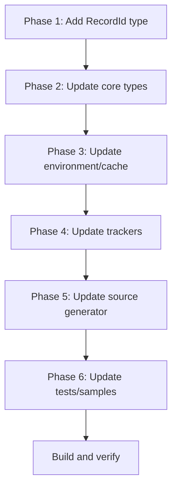

# RecordId Refactoring Plan

## Overview

This document describes the plan to introduce a `RecordId` record struct that wraps the raw integer/long ID values for Odoo records. This follows the same pattern as `FieldHandle` and `ModelHandle` but for record identifiers.

## Goals

1. **Type Safety**: Prevent accidental mixing of record IDs with other integer values
2. **Future-Proofing**: Easy migration from `int` to `long` (backing type will be `long` from start)
3. **Extensibility**: Ability to add methods, validation, or formatting to IDs
4. **Consistency**: Align with existing `FieldHandle`/`ModelHandle` patterns

## The RecordId Type

```csharp
/// <summary>
/// Strongly-typed wrapper for record IDs.
/// Uses long backing type to support large databases.
/// </summary>
public readonly record struct RecordId(long Value)
{
    /// <summary>
    /// Implicit conversion to long for compatibility with cache operations.
    /// </summary>
    [MethodImpl(MethodImplOptions.AggressiveInlining)]
    public static implicit operator long(RecordId id) => id.Value;
    
    /// <summary>
    /// Implicit conversion from long for easy construction.
    /// </summary>
    [MethodImpl(MethodImplOptions.AggressiveInlining)]
    public static implicit operator RecordId(long value) => new(value);
    
    /// <summary>
    /// Implicit conversion from int for backward compatibility.
    /// </summary>
    [MethodImpl(MethodImplOptions.AggressiveInlining)]
    public static implicit operator RecordId(int value) => new(value);
    
    /// <summary>
    /// Check if this is a valid (non-zero) ID.
    /// </summary>
    public bool IsValid => Value > 0;
    
    /// <summary>
    /// Represents an invalid/empty record ID.
    /// </summary>
    public static readonly RecordId Empty = new(0);
    
    public override string ToString() => Value.ToString();
}
```

## Files to Modify

### Phase 1: Core Type Definition
| File | Changes |
|------|---------|
| `src/Odoo.Core/FieldHandle.cs` | Add `RecordId` record struct |

### Phase 2: Core Framework Types
| File | Changes |
|------|---------|
| `src/Odoo.Core/RecordHandle.cs` | Change `int Id` to `RecordId Id` |
| `src/Odoo.Core/OdooFramework.cs` | Change `IOdooRecord.Id` from `int` to `RecordId`, update `RecordSet<T>.Ids` to `RecordId[]` |

### Phase 3: Environment & Cache
| File | Changes |
|------|---------|
| `src/Odoo.Core/OdooEnvironment.cs` | Update identity map keys, method signatures (~15 methods) |
| `src/Odoo.Core/IColumnarCache.cs` | Change `int id` / `int[] ids` parameters to `RecordId` / `RecordId[]` |
| `src/Odoo.Core/ColumnarValueCache.cs` | Update implementation to use `RecordId` |

### Phase 4: Tracking Systems
| File | Changes |
|------|---------|
| `src/Odoo.Core/DirtyTracker.cs` | Change `int recordId` parameters to `RecordId`, update dictionary keys |
| `src/Odoo.Core/ComputeTracker.cs` | Change `int recordId` parameters to `RecordId`, update dictionary keys |
| `src/Odoo.Core/IdGenerator.cs` | Return `RecordId` instead of `int`, change internal counter to `long` |

### Phase 5: Source Generator
| File | Changes |
|------|---------|
| `src/Odoo.SourceGenerator/OdooModelGenerator.cs` | Generate code using `RecordId` instead of `int` |

### Phase 6: Tests & Samples
| File | Changes |
|------|---------|
| `tests/Odoo.Tests/PartnerUsageTests.cs` | Update test code to use `RecordId` |
| `tests/Odoo.Tests/RecordValueFieldTests.cs` | Update test code to use `RecordId` |
| `samples/Odoo.Demo/*` | Update sample code |

## Detailed Changes by File

### 1. `src/Odoo.Core/FieldHandle.cs` (Add RecordId)

Add alongside existing `FieldHandle` and `ModelHandle`:

```csharp
/// <summary>
/// Strongly-typed wrapper for record IDs.
/// Uses long backing type to support large databases.
/// Provides type safety and enables future migrations.
/// </summary>
public readonly record struct RecordId(long Value)
{
    [MethodImpl(MethodImplOptions.AggressiveInlining)]
    public static implicit operator long(RecordId id) => id.Value;
    
    [MethodImpl(MethodImplOptions.AggressiveInlining)]
    public static implicit operator RecordId(long value) => new(value);
    
    [MethodImpl(MethodImplOptions.AggressiveInlining)]
    public static implicit operator RecordId(int value) => new(value);
    
    public bool IsValid => Value > 0;
    public static readonly RecordId Empty = new(0);
    
    public override string ToString() => Value.ToString();
}
```

### 2. `src/Odoo.Core/RecordHandle.cs`

```csharp
public readonly struct RecordHandle : IEquatable<RecordHandle>
{
    public readonly IEnvironment Env;
    public readonly RecordId Id;  // Changed from int
    public readonly ModelHandle Model;

    public RecordHandle(IEnvironment env, RecordId id, ModelHandle model)
    {
        Env = env;
        Id = id;
        Model = model;
    }
    
    // Update equality to use Id.Value
    public bool Equals(RecordHandle other) =>
        Id == other.Id && Model.Token == other.Model.Token && Env == other.Env;
        
    public override int GetHashCode() => HashCode.Combine(Env, Id.Value, Model);
}
```

### 3. `src/Odoo.Core/OdooFramework.cs`

```csharp
public interface IOdooRecord
{
    RecordId Id { get; }  // Changed from int
    IEnvironment Env { get; }
}

public readonly struct RecordSet<T> : IEnumerable<T>
    where T : IOdooRecord
{
    public readonly IEnvironment Env;
    public readonly string ModelName;
    public readonly RecordId[] Ids;  // Changed from int[]
    
    private readonly Func<IEnvironment, RecordId, T> _recordFactory;  // Updated signature
    
    // Constructor updated
    public RecordSet(
        IEnvironment env,
        string modelName,
        RecordId[] ids,
        Func<IEnvironment, RecordId, T> factory)
    {
        // ...
    }
}

public interface IEnvironment
{
    // Updated signatures
    RecordSet<T> CreateRecordSet<T>(RecordId[] ids) where T : IOdooRecord;
    // ...
}
```

### 4. `src/Odoo.Core/OdooEnvironment.cs`

Key changes:
- Identity map: `Dictionary<(int ModelToken, RecordId Id), IOdooRecord>`
- Protection: `Dictionary<FieldHandle, HashSet<RecordId>>`
- All methods using `int id` → `RecordId id`

### 5. `src/Odoo.Core/IColumnarCache.cs`

All methods updated:
```csharp
T GetValue<T>(ModelHandle model, RecordId id, FieldHandle field);
void SetValue<T>(ModelHandle model, RecordId id, FieldHandle field, T value);
ReadOnlySpan<T> GetColumnSpan<T>(ModelHandle model, RecordId[] ids, FieldHandle field);
// etc.
```

### 6. `src/Odoo.Core/IdGenerator.cs`

```csharp
public class IdGenerator
{
    private readonly ConcurrentDictionary<string, long> _counters = new();  // Changed to long

    public RecordId NextId(string modelName)  // Returns RecordId
    {
        return new RecordId(_counters.AddOrUpdate(modelName, 1000L, (_, current) => current + 1));
    }

    public void SetStartId(string modelName, long startId)  // Takes long
    {
        _counters[modelName] = startId;
    }
}
```

### 7. Source Generator Updates

The generator needs to produce code like:
```csharp
// Generated wrapper class
public sealed class ResPartner : IPartnerBase, IRecordWrapper
{
    public RecordId Id => _handle.Id;  // Returns RecordId
    // ...
}

// Generated environment extensions
public static IPartnerBase Create(this IEnvironment env, ResPartnerValues values)
{
    // Uses RecordId internally
}
```

## Migration Strategy

1. **Backward Compatibility**: The implicit conversions from `int` and `long` allow existing code to continue working during migration
2. **Incremental Updates**: Each file can be updated independently
3. **Compile-Time Safety**: After removing implicit conversions (if desired), compiler catches all usages

## Performance Considerations

- `RecordId` is a `readonly record struct` - zero allocation, value semantics
- `long` backing type is 8 bytes vs 4 bytes for `int` - minimal memory impact
- Implicit conversions are marked `[MethodImpl(MethodImplOptions.AggressiveInlining)]` for zero overhead
- Dictionary keys using `RecordId` work efficiently due to record struct equality

## Testing Strategy

1. Update existing tests to use `RecordId` explicitly
2. Verify all tests pass
3. Add specific tests for `RecordId`:
   - Equality/inequality
   - Hash code consistency
   - Implicit conversions
   - `IsValid` property
   - `Empty` sentinel value

## Execution Order



## Risks & Mitigations

| Risk | Mitigation |
|------|------------|
| Breaking changes | Implicit conversions provide backward compatibility |
| Performance regression | Benchmarks before/after; inline hints on conversions |
| Source generator complexity | Update generator incrementally, test each change |
| Missed usages | Compiler errors guide updates; search for `int id` patterns |

## Estimated Effort

| Phase | Files | Estimated Time |
|-------|-------|----------------|
| Phase 1 | 1 | 5 min |
| Phase 2 | 2 | 15 min |
| Phase 3 | 3 | 30 min |
| Phase 4 | 3 | 20 min |
| Phase 5 | 1 | 45 min |
| Phase 6 | 4+ | 30 min |
| **Total** | ~14 | ~2.5 hours |