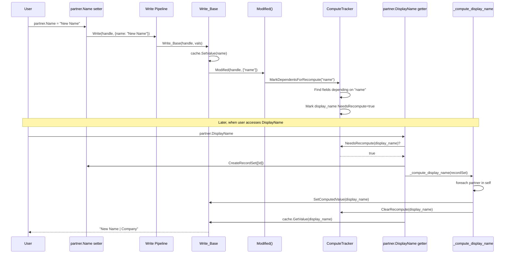

# Write/Create Pipeline Architecture

## Implementation Status: ✅ COMPLETE (Automatic Compute)

The Write/Create pipeline architecture has been fully implemented and is working. Computed fields are functional with **automatic recomputation** based on `[OdooDepends]`.

---

## Current Implementation

### What's Working

| Feature | Status | Files |
|---------|--------|-------|
| Property setters → Write pipeline | ✅ | OdooModelGenerator.cs |
| Property getters → Direct cache read | ✅ | OdooModelGenerator.cs |
| Unified Create pipeline | ✅ | OdooModelGenerator.cs |
| Module overrides via `[OdooLogic]` | ✅ | PipelineRegistry.cs |
| Dirty tracking | ✅ | DirtyTracker.cs |
| ComputeTracker infrastructure | ✅ | ComputeTracker.cs |
| SetComputedValue helper | ✅ | OdooEnvironment.cs |
| Computed field attributes | ✅ | ComputedFieldAttributes.cs |
| Manual compute method calls | ✅ | Demo 8 |
| **Automatic compute triggers** | ✅ | `[OdooDepends]` triggers recompute |

### Demos

- **Demo 7**: Write/Create Pipeline - Shows module override pattern
- **Demo 8**: Computed Fields - Shows automatic recomputation via `[OdooDepends]`

---

## ✅ COMPLETED: Automatic Computed Field Triggering

### Solution Implemented

Computed field recomputation is now **automatic**. The ORM automatically triggers recomputation when dependent fields change, or when a computed field is accessed and marked as needing recomputation.

### Changes Made

| Task | File | Description |
|------|------|-------------|
| **1.1** | `OdooModelGenerator.cs` | Generated Modified() call in Write_Base when stored fields change |
| **1.2** | `OdooModelGenerator.cs` | Updated property setter to call Modified() after Write |
| **1.3** | `RegistryBuilder.cs` | Builds dependency graph at startup from `[OdooDepends]` attributes |
| **1.4** | `OdooModelGenerator.cs` | Generated getter logic to check NeedsRecompute and auto-trigger pipeline |
| **1.5** | `ComputedFieldDemo.cs` | Updated demo to show automatic recomputation |

### Sequence Diagram: Automatic Recomputation



### Implementation Details

#### 1. Build Dependency Graph at Startup

The `ComputeTracker` needs to know which fields trigger recomputation of which computed fields:

```csharp
// In ComputeTracker.cs or RegistryBuilder.cs
public void RegisterDependencies(string modelName, string computedField, string[] dependsOn)
{
    // When "name" changes → recompute "display_name"
    // When "is_company" changes → recompute "display_name"
    foreach (var sourceField in dependsOn)
    {
        var key = (modelName, sourceField);
        if (!_dependencyGraph.TryGetValue(key, out var dependents))
        {
            dependents = new HashSet<string>();
            _dependencyGraph[key] = dependents;
        }
        dependents.Add(computedField);
    }
}
```

#### 2. Modified() Triggers Recompute Marking

```csharp
// In OdooEnvironment.cs - Modified should look up dependency graph
public void Modified(ModelHandle model, int recordId, FieldHandle field, string fieldName)
{
    // Mark field as dirty
    DirtyTracker.MarkDirty(model, recordId, field);
    
    // Find computed fields that depend on this field
    var dependents = ComputeTracker.GetDependentFields(model, fieldName);
    foreach (var dependentField in dependents)
    {
        ComputeTracker.MarkNeedsRecompute(model, recordId, dependentField);
    }
}
```

#### 3. Generated Getter Checks NeedsRecompute

```csharp
// Generated in Partner.g.cs
public string DisplayName
{
    get
    {
        // Check if recomputation is needed
        if (Env is OdooEnvironment odooEnv &&
            odooEnv.ComputeTracker.NeedsRecompute(
                ModelSchema.Partner.ModelToken, Id, ModelSchema.Partner.DisplayName))
        {
            // Create single-record RecordSet and trigger compute pipeline
            var recordSet = odooEnv.CreateRecordSet<IPartnerBase>(new[] { Id });
            PartnerPipelines.Compute_DisplayName(recordSet);
        }
        
        // Return from cache
        return Env.Columns.GetValue<string>(
            ModelSchema.Partner.ModelToken, Id, ModelSchema.Partner.DisplayName);
    }
}
```

---

## Architecture Overview

### Odoo vs Our C# Implementation

| Odoo Python | Our C# |
|-------------|--------|
| `Field.__set__` → `write()` | Setter → `Write()` pipeline |
| `Field.__get__` → cache | Getter → direct cache (+ recompute check for computed) |
| `@api.depends('name')` | `[OdooDepends("name")]` |
| `compute='_compute_foo'` | `[OdooCompute("_compute_foo")]` |
| `def _compute_foo(self):` | `void ComputeFoo(RecordSet<T> self)` |
| `for rec in self:` | `foreach (var r in self)` |
| Override `write()` method | `[OdooLogic("model", "write")]` |
| Override `create()` method | `[OdooLogic("model", "create")]` |

### Key Architecture Decisions

1. ✅ **No getter pipelines** - Direct cache reads for performance (Odoo-aligned)
2. ✅ **Unified Write pipeline** - Single extensibility point for all field changes
3. ✅ **Unified Create pipeline** - Single extensibility point for record creation
4. ✅ **Batch compute pattern** - `RecordSet<T>` parameter like Odoo's `for record in self:`
5. ✅ **SetComputedValue** - Bypasses Write pipeline to avoid recursion
6. ✅ **Lazy recomputation** - Computed fields recompute on access, not on dependency change
7. ✅ **Automatic triggers** - Modified() marks dependents for recompute

---

## Files Overview

### Core Infrastructure

| File | Purpose |
|------|---------|
| [`DirtyTracker.cs`](../src/Odoo.Core/DirtyTracker.cs) | Tracks modified fields for flush |
| [`ComputeTracker.cs`](../src/Odoo.Core/ComputeTracker.cs) | Tracks fields needing recomputation |
| [`OdooEnvironment.cs`](../src/Odoo.Core/OdooEnvironment.cs) | Environment with Flush(), Modified(), SetComputedValue() |
| [`ComputedFieldAttributes.cs`](../src/Odoo.Core/Attributes/ComputedFieldAttributes.cs) | All computed field attributes |

### Source Generator

| File | What It Generates |
|------|-------------------|
| [`OdooModelGenerator.cs`](../src/Odoo.SourceGenerator/OdooModelGenerator.cs) | Wrapper classes, pipelines, schema |

### Generated Code (per model)

- `{Model}.g.cs` - Wrapper class with properties
- `{Model}Pipelines.g.cs` - Write, Create, Compute pipelines
- `{Model}Values.g.cs` - Values struct for creation
- `ModelSchema.g.cs` - Field and model tokens

---

## Usage Examples

### Property Assignment → Write Pipeline

```csharp
// User code
partner.Name = "Acme Corp";

// Generated setter delegating to Write pipeline
set => PartnerPipelines.Write(_handle, new Dictionary<string, object?> { { "name", value } });

// Write pipeline chain: [Sale.Write_Override] → [Write_Base]
// Write_Base: cache.SetValue() + cache.MarkDirty() + Modified()
```

### Record Creation → Create Pipeline

```csharp
// User code
var partner = env.Create(new ResPartnerValues { Name = "Test", IsCompany = true });

// Create pipeline chain: [Account.Create_Override] → [Create_Base]
// Create_Base: IdGen.NextId() + new Partner() + Write_Base()
```

### Module Override

```csharp
// In Sale module
[OdooLogic("res.partner", "write")]
public static void Write_SaleOverride(
    RecordHandle handle,
    Dictionary<string, object?> vals,
    Action<RecordHandle, Dictionary<string, object?>> super)
{
    Console.WriteLine("[Sale] PRE-WRITE: Modifying partner");
    vals["write_date"] = DateTime.UtcNow;  // Add write_date
    
    super(handle, vals);  // Call next in chain
    
    Console.WriteLine("[Sale] POST-WRITE: Partner updated");
}
```

### Computed Field Definition

```csharp
// In IPartnerBase interface
[OdooField("display_name")]
[OdooCompute("_compute_display_name")]
[OdooDepends("name", "is_company")]
string DisplayName { get; }  // Read-only computed field

// In PartnerLogic.cs
[OdooLogic("res.partner", "_compute_display_name")]
public static void ComputeDisplayName(RecordSet<IPartnerBase> self)
{
    foreach (var partner in self)
    {
        var displayName = partner.IsCompany
            ? $"{partner.Name} | Company"
            : partner.Name;
        
        partner.Env.SetComputedValue(model, partner.Id, field, displayName);
    }
}
```

---

## Running the Demos

```bash
# Write/Create Pipeline Demo
cd samples/Odoo.Demo && dotnet run -- 7

# Computed Fields Demo (automatic triggers)
cd samples/Odoo.Demo && dotnet run -- 8
```

---

## Pipeline Count Comparison

| Model with N fields, C computed | Before (Per-field) | After (Unified) |
|---------------------------------|-------------------|-----------------|
| Getter pipelines | N | 0 |
| Setter pipelines | N | 0 |
| Write pipeline | 0 | 1 |
| Create pipeline | 0 | 1 |
| Compute pipelines | 0 | C |
| **Total** | **2N** | **2 + C** |

---

## Benefits

1. ✅ **Odoo-aligned** - Same patterns as Odoo Python ORM
2. ✅ **Type-safe** - Strong typing with Values structs and interfaces
3. ✅ **High performance** - Direct cache reads, compiled pipelines, columnar storage
4. ✅ **Module extensibility** - Override Write/Create via `[OdooLogic]`
5. ✅ **Computed fields** - Batch pattern with automatic recomputation
6. ✅ **Dirty tracking** - Lazy persistence with explicit Flush()