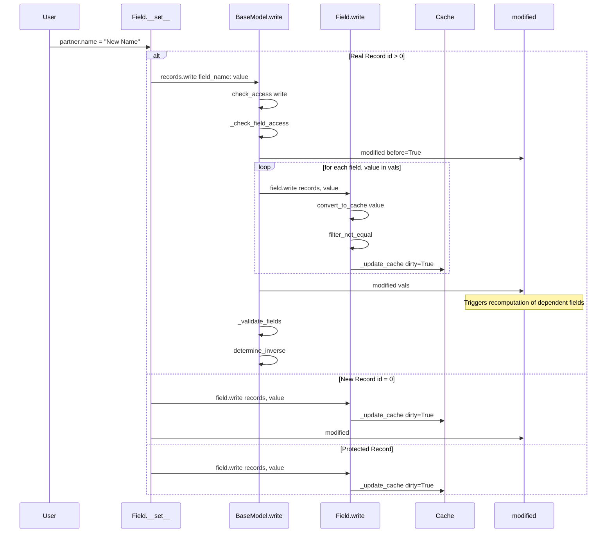
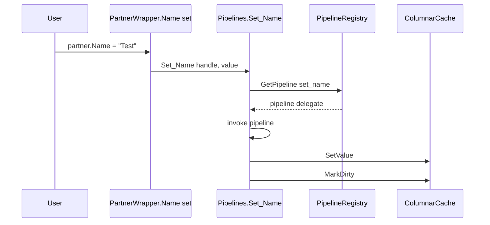
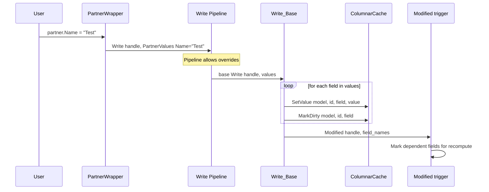
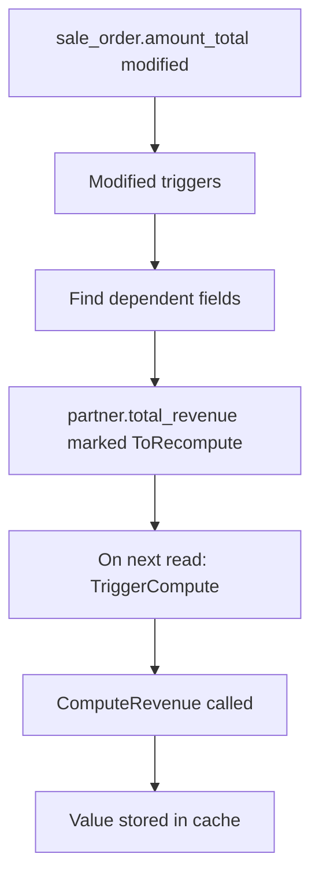
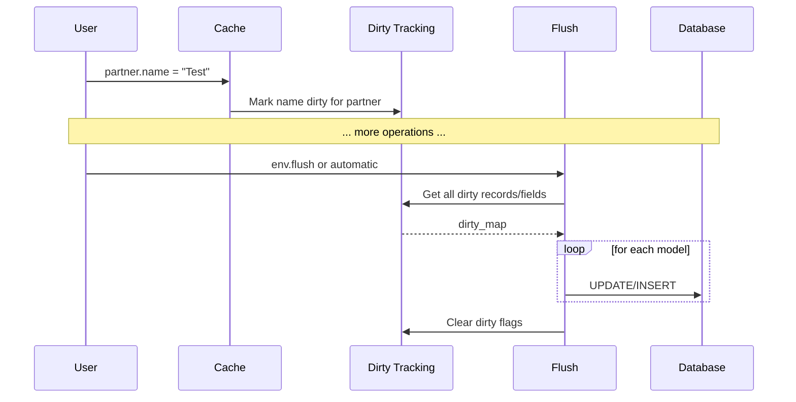

# Write/Create Pipeline Architecture

## Executive Summary

This document proposes improvements to align our C# ORM with Odoo's extensibility model while maintaining our distinctive features: **type safety** and **high performance**.

The key change: **Property setters delegate to a unified `Write()` method with pipeline support**, rather than having individual pipelines per property setter.

---

## Part 1: How Odoo's ORM Works

### Sequence Diagram: Odoo Property Assignment



### Key Code from Odoo (fields.py lines 1802-1838)

```python
def __set__(self, records: BaseModel, value) -> None:
    """ set the value of field ``self`` on ``records`` """
    protected_ids = []
    new_ids = []
    other_ids = []
    for record_id in records._ids:
        if record_id in records.env._protected.get(self, ()):
            protected_ids.append(record_id)
        elif not record_id:
            new_ids.append(record_id)
        else:
            other_ids.append(record_id)

    if protected_ids:
        # records being computed: no business logic, no recomputation
        self.write(protected_records, value)

    if new_ids:
        # new records: no business logic
        with records.env.protecting(...):
            self.write(new_records, value)
            new_records.modified([self.name])

    if other_ids:
        # ⭐ KEY INSIGHT: Real records delegate to BaseModel.write()
        records = records.browse(other_ids)
        write_value = self.convert_to_write(value, records)
        records.write({self.name: write_value})  # <-- Single extensibility point!
```

### Sequence Diagram: Odoo Create

```mermaid
sequenceDiagram
    participant User
    participant Model as BaseModel.create
    participant Defaults as _add_missing_default_values
    participant Create as _create
    participant DB as Database
    participant Inverse as determine_inverse
    
    User->>Model: env.res_partner.create vals_list
    Model->>Model: check_access create
    Model->>Defaults: _add_missing_default_values
    Defaults-->>Model: vals_list with defaults
    Model->>Model: _prepare_create_values
    Model->>Model: classify fields stored/inverse/inherited
    
    loop for precompute fields
        Model->>Model: compute precompute values
    end
    
    Model->>Create: _create data_list
    Create->>DB: INSERT INTO table
    DB-->>Create: new record ids
    Create-->>Model: new records
    
    loop for inverse fields
        Model->>Inverse: field.determine_inverse
    end
    
    Model->>Model: _validate_fields
    Model-->>User: new records
```

### Key Takeaways from Odoo

1. **`write()` is THE extensibility point** - All property assignments for real records go through `BaseModel.write()`
2. **Modules override `write()`** to add business logic, not individual field setters
3. **`modified()` triggers recomputation** - After write, dependent fields are marked for recompute
4. **`create()` is a separate extensibility point** with similar override capability
5. **Lazy flush pattern** - Cache is marked dirty, actual SQL happens at flush time

---

## Part 2: Current C# Implementation Analysis

### Current Architecture (from OdooModelGenerator.cs)



### Current Generated Code (from OdooModelGenerator.cs lines 387-395, 459-481)

```csharp
// Wrapper property
public string Name
{
    get => PartnerPipelines.Get_Name(_handle);
    set => PartnerPipelines.Set_Name(_handle, value);  // ❌ Per-property pipeline
}

// Pipeline class
public static void Set_Name(RecordHandle handle, string value)
{
    var pipeline = handle.Env.GetPipeline<Action<RecordHandle, string>>(
        "res.partner", "set_name");  // ❌ One pipeline per field
    pipeline(handle, value);
}

public static void Set_Name_Base(RecordHandle handle, string value)
{
    handle.Env.Columns.SetValue(...);
    handle.Env.Columns.MarkDirty(...);
}
```

### Problems with Current Approach

| Problem | Description |
|---------|-------------|
| **N pipelines per model** | Each field has separate `get_*` and `set_*` pipelines |
| **No unified extensibility** | Cannot override `Write()` to intercept all field changes |
| **Misaligned with Odoo** | Modules can't easily add business logic on write |
| **No `modified()` equivalent** | No trigger for dependent field recomputation |
| **Missing `create()` pipeline** | Record creation has no extensibility point |

---

## Part 3: Proposed Architecture

### New Sequence Diagram: Property Assignment



### New Sequence Diagram: Record Creation

```mermaid
sequenceDiagram
    participant User
    participant Env as Environment
    participant Create as Create Pipeline
    participant Base as Create_Base
    participant IdGen as IdGenerator
    participant Cache as ColumnarCache
    participant Identity as IdentityMap
    
    User->>Env: env.Create PartnerValues Name="Test", IsCompany=true
    Env->>Create: Create Pipeline
    
    Note over Create: Pipeline allows overrides
    Create->>Base: base Create values
    
    Base->>IdGen: NextId res.partner
    IdGen-->>Base: newId
    Base->>Cache: SetValue for each field
    Base->>Identity: RegisterInIdentityMap
    Base-->>Create: new record
    Create-->>Env: new record
    Env-->>User: IPartner instance
```

### Proposed Generated Code

#### 1. Values Struct (already exists, keep it)

```csharp
public struct PartnerValues
{
    public string? Name { get; init; }
    public bool? IsCompany { get; init; }
    public int? ParentId { get; init; }
}
```

#### 2. New Wrapper Property Implementation

```csharp
public sealed class Partner : IPartnerBase, IRecordWrapper
{
    private readonly RecordHandle _handle;
    
    public string Name
    {
        // ⭐ Getter uses DIRECT cache read (no pipeline) - Odoo aligned
        get => _handle.Env.Columns.GetValue<string>(
            ModelSchema.Partner.ModelToken, _handle.Id, ModelSchema.Partner.Name);
        
        // ⭐ Setter delegates to Write() - single extensibility point
        set => PartnerPipelines.Write(_handle, new PartnerValues { Name = value });
    }
    
    public bool IsCompany
    {
        // Direct cache read
        get => _handle.Env.Columns.GetValue<bool>(
            ModelSchema.Partner.ModelToken, _handle.Id, ModelSchema.Partner.IsCompany);
        set => PartnerPipelines.Write(_handle, new PartnerValues { IsCompany = value });
    }
}
```

#### 3. New Pipelines Class

```csharp
public static class PartnerPipelines
{
    // ⭐ SINGLE Write pipeline for ALL field assignments
    public static void Write(RecordHandle handle, PartnerValues values)
    {
        var pipeline = handle.Env.GetPipeline<Action<RecordHandle, PartnerValues>>(
            "res.partner", "write");
        pipeline(handle, values);
    }
    
    // Base implementation - called at end of pipeline chain
    public static void Write_Base(RecordHandle handle, PartnerValues values)
    {
        var changedFields = new List<string>();
        
        if (values.Name is not null)
        {
            handle.Env.Columns.SetValue(
                ModelSchema.Partner.ModelToken, handle.Id,
                ModelSchema.Partner.Name, values.Name);
            handle.Env.Columns.MarkDirty(
                ModelSchema.Partner.ModelToken, handle.Id,
                ModelSchema.Partner.Name);
            changedFields.Add("name");
        }
        
        if (values.IsCompany is not null)
        {
            handle.Env.Columns.SetValue(
                ModelSchema.Partner.ModelToken, handle.Id,
                ModelSchema.Partner.IsCompany, values.IsCompany.Value);
            handle.Env.Columns.MarkDirty(
                ModelSchema.Partner.ModelToken, handle.Id,
                ModelSchema.Partner.IsCompany);
            changedFields.Add("is_company");
        }
        
        // Trigger recomputation of dependent fields
        if (changedFields.Count > 0)
        {
            PartnerPipelines.Modified(handle, changedFields);
        }
    }
    
    // ⭐ SINGLE Create pipeline
    public static IPartnerBase Create(IEnvironment env, PartnerValues values)
    {
        var pipeline = env.GetPipeline<Func<IEnvironment, PartnerValues, IPartnerBase>>(
            "res.partner", "create");
        return pipeline(env, values);
    }
    
    public static IPartnerBase Create_Base(IEnvironment env, PartnerValues values)
    {
        var newId = env.IdGenerator.NextId("res.partner");
        var handle = new RecordHandle(env, newId, ModelSchema.Partner.ModelToken);
        var record = new Partner(handle);
        
        // Register in identity map
        if (env is OdooEnvironment odooEnv)
            odooEnv.RegisterInIdentityMap(ModelSchema.Partner.ModelToken.Token, newId, record);
        
        // Write values
        Write_Base(handle, values);
        
        return record;
    }
    
    // ⭐ NO getter methods in Pipelines class - getters read directly from cache
    // Computed fields have their compute method registered, not getter pipelines
    
    // Modified - triggers dependent field recomputation
    public static void Modified(RecordHandle handle, IEnumerable<string> fieldNames)
    {
        // TODO: Implement field dependency graph traversal
        // Mark computed fields that depend on changed fields for recompute
    }
}
```

#### 4. How Modules Override Write

```csharp
// In Sale module
public static class PartnerSaleExtensions
{
    [OdooLogic("res.partner", "write")]
    public static void Write_SaleExtension(
        RecordHandle handle, 
        PartnerValues values,
        Action<RecordHandle, PartnerValues> super)  // super = next in pipeline
    {
        // Pre-write business logic
        if (values.IsCompany == true)
        {
            // Custom logic when becoming a company
            Console.WriteLine($"Partner {handle.Id} is now a company!");
        }
        
        // Call next in pipeline (eventually reaches Write_Base)
        super(handle, values);
        
        // Post-write business logic
        // e.g., update related sale orders
    }
}
```

---

## Part 4: Implementation Plan

### Phase 1: Core Infrastructure

1. **Add `Modified` support to cache** (track field dependencies)
2. **Add field dependency graph** to ModelSchema
3. **Update IPipelineBuilder** with standard method signatures

### Phase 2: Generator Changes

1. **Modify property getters** to use direct cache reads (no pipelines)
2. **Modify property setters** to delegate to `Write()`
3. **Generate unified `Write()` pipeline** per model
4. **Generate unified `Create()` pipeline** per model
5. **Generate `Modified()` method** for dependency tracking
6. **Generate computed field recompute triggers** in getters

### Phase 3: Module Registrar Updates

1. **Update ModuleRegistrar** to register `write` and `create` pipelines
2. **Support `super` parameter** for override chaining
3. **Handle pipeline priority** based on module dependencies

### Files to Modify

| File | Changes |
|------|---------|
| `OdooModelGenerator.cs` | Regenerate wrapper properties, add Write/Create pipelines |
| `IPipelineBuilder.cs` | Add standard delegate types for Write/Create |
| `PipelineRegistry.cs` | Optimize for fewer, heavier pipelines |
| `ModelSchema.cs` | Add field dependency graph |
| `IColumnarCache.cs` | Add Modified trigger support |

---

## Part 5: Benefits Summary

| Aspect | Current | Proposed |
|--------|---------|----------|
| **Pipelines per model** | N×2 (get+set per field) | 2 + C (write + create + computed) |
| **Override model** | Override individual setters | Override `Write()` - Odoo style |
| **Type safety** | ✅ Strong | ✅ Strong (Values struct) |
| **Performance** | Good | **Excellent** (direct cache reads) |
| **Odoo alignment** | Partial | Full |
| **Business logic hooks** | Scattered | Centralized in Write/Create |
| **Recomputation** | Manual | Automatic via Modified |

---

## Part 6: Getter Pipelines - Tradeoff Analysis

### The Question

Should property getters use pipelines (current approach) or directly read from cache (Odoo's approach)?

### Option A: Keep Getter Pipelines

```csharp
public string Name
{
    get => PartnerPipelines.Get_Name(_handle);  // Pipeline lookup + invoke
}
```

| Pros | Cons |
|------|------|
| Can intercept reads with overrides | Pipeline lookup overhead on EVERY read |
| Future flexibility for "on read" hooks | Not aligned with Odoo |
| Could support lazy computation override | N additional pipelines per model |
| | Adds complexity without clear benefit |

### Option B: Direct Cache Read (Recommended ✅)

```csharp
public string Name
{
    get => _handle.Env.Columns.GetValue<string>(
        ModelSchema.Partner.ModelToken, _handle.Id, ModelSchema.Partner.Name);
}
```

| Pros | Cons |
|------|------|
| **Best performance** - direct cache access | No read interception |
| **Aligned with Odoo** - no read override | Less flexible |
| Simpler architecture | |
| Computed fields still work (compute on cache miss) | |

### How Odoo Handles This

In Odoo's `Field.__get__()` (fields.py lines 1637-1800):
1. Check if value is in cache
2. If cache miss AND field is computed → call `compute_value()`
3. Return from cache

**Key insight**: Odoo has NO getter pipeline. Extensibility for computed fields is via the **compute method**, not the getter. The compute method can be overridden by inheriting modules.

### Decision: Direct Cache Reads ✅

We will **remove getter pipelines** and use direct cache access because:
1. **Performance**: Eliminates pipeline lookup on every property read
2. **Odoo alignment**: Matches Odoo's actual architecture
3. **Computed fields**: The compute method provides the extensibility hook, not the getter
4. **Simplicity**: Fewer moving parts, easier to understand

---

## Part 7: Computed Fields Architecture

### Odoo's Computed Field Pattern

```python
class Partner(models.Model):
    total_revenue = fields.Float(compute='_compute_revenue', store=True)
    
    @api.depends('sale_order_ids.amount_total')
    def _compute_revenue(self):
        for record in self:
            record.total_revenue = sum(record.sale_order_ids.mapped('amount_total'))
```

### Our C# Equivalent

```csharp
[OdooModel("res.partner")]
public interface IPartnerBase : IOdooRecord
{
    string Name { get; set; }
    
    [OdooField("total_revenue")]
    [OdooCompute(nameof(PartnerComputeMethods.ComputeRevenue))]
    [OdooDepends("sale_order_ids.amount_total")]
    decimal TotalRevenue { get; }  // Computed field - no setter
}

// Compute methods in separate class
public static class PartnerComputeMethods
{
    [OdooCompute("res.partner", "total_revenue")]
    public static void ComputeRevenue(RecordSet<IPartnerBase> records)
    {
        foreach (var record in records)
        {
            // Access related records and compute
            var total = record.SaleOrderIds.Sum(o => o.AmountTotal);
            // Use internal setter that bypasses Write pipeline
            PartnerPipelines.SetComputedValue(record.Handle,
                ModelSchema.Partner.TotalRevenue, total);
        }
    }
}
```

### Generated Code for Computed Fields

```csharp
public sealed class Partner : IPartnerBase
{
    // Stored field - normal getter (direct cache)
    public string Name
    {
        get => _handle.Env.Columns.GetValue<string>(
            ModelSchema.Partner.ModelToken, _handle.Id, ModelSchema.Partner.Name);
        set => PartnerPipelines.Write(_handle, new PartnerValues { Name = value });
    }
    
    // Computed field - triggers computation on cache miss
    public decimal TotalRevenue
    {
        get
        {
            var cache = _handle.Env.Columns;
            
            // Check if needs recompute
            if (NeedsRecompute(_handle, ModelSchema.Partner.TotalRevenue))
            {
                TriggerCompute(_handle, "total_revenue");
            }
            
            return cache.GetValue<decimal>(
                ModelSchema.Partner.ModelToken, _handle.Id,
                ModelSchema.Partner.TotalRevenue);
        }
        // No setter - computed fields are read-only to user code
    }
}
```

### Dependency Graph



---

## Part 8: Batch Write & RecordSet Operations

### Single vs Batch Write

```csharp
// Single record write (property setter)
partner.Name = "Test";
// → Pipelines.Write(handle, new Values { Name = "Test" })

// Batch write (RecordSet method)
partners.Write(new PartnerValues { IsActive = false });
// → Pipelines.WriteMany(handles[], new Values { IsActive = false })
```

### Generated RecordSet Extensions

```csharp
public static class PartnerRecordSetExtensions
{
    /// <summary>
    /// Write values to all records in the set.
    /// Like Odoo's records.write(vals).
    /// </summary>
    public static void Write(this RecordSet<IPartnerBase> self, PartnerValues values)
    {
        var pipeline = self.Env.GetPipeline<Action<RecordSet<IPartnerBase>, PartnerValues>>(
            "res.partner", "write");
        pipeline(self, values);
    }
    
    public static void Write_Base(RecordSet<IPartnerBase> self, PartnerValues values)
    {
        var changedFields = new List<string>();
        
        // Batch update cache for all records
        if (values.Name is not null)
        {
            var names = new string[self.Ids.Length];
            Array.Fill(names, values.Name);
            
            self.Env.Columns.SetColumnValues(
                ModelSchema.Partner.ModelToken,
                self.Ids,
                ModelSchema.Partner.Name,
                names.AsSpan());
                
            foreach (var id in self.Ids)
                self.Env.Columns.MarkDirty(ModelSchema.Partner.ModelToken, id, ModelSchema.Partner.Name);
            
            changedFields.Add("name");
        }
        
        // Trigger modified for all records
        if (changedFields.Count > 0)
            Modified(self, changedFields);
    }
}
```

---

## Part 9: Flush Pattern

### Odoo's Flush Architecture



### Our Flush Implementation

```csharp
public interface IEnvironment
{
    // ... existing ...
    
    /// <summary>
    /// Flush all pending changes to database.
    /// </summary>
    void Flush();
    
    /// <summary>
    /// Flush changes for specific model.
    /// </summary>
    void FlushModel(string modelName);
    
    /// <summary>
    /// Flush changes for specific fields.
    /// </summary>
    void FlushFields(string modelName, params string[] fieldNames);
}

public class OdooEnvironment : IEnvironment
{
    private readonly DirtyTracker _dirtyTracker = new();
    
    public void Flush()
    {
        // Get all dirty records grouped by model
        var dirtyByModel = _dirtyTracker.GetAllDirty();
        
        foreach (var (modelName, recordFields) in dirtyByModel)
        {
            // Generate UPDATE statements for each record
            foreach (var (recordId, dirtyFields) in recordFields)
            {
                var values = BuildValuesFromCache(modelName, recordId, dirtyFields);
                // Execute database update
                _database.Update(modelName, recordId, values);
            }
        }
        
        _dirtyTracker.ClearAll();
    }
}
```

---

## Part 10: Dual API - Type-Safe + Dynamic

### Architecture Layers

```
┌─────────────────────────────────────────────────────┐
│  Python/Dynamic Layer - Dictionary-based API        │
│  env["res.partner"].Write(new { name = "Test" })    │
├─────────────────────────────────────────────────────┤
│  Type-Safe Layer - Values struct                    │
│  partner.Write(new PartnerValues { Name = "Test" }) │
├─────────────────────────────────────────────────────┤
│  Core Layer - Direct cache operations               │
│  cache.SetValue(model, id, field, value)            │
└─────────────────────────────────────────────────────┘
```

### Dynamic API Implementation

```csharp
/// <summary>
/// Dynamic model proxy for Pythonic API.
/// Converts anonymous objects/dictionaries to strongly-typed Values.
/// </summary>
public class ModelProxy
{
    public IOdooRecord Create(object values)
    {
        // Convert anonymous object to Dictionary<string, object?>
        var dict = ConvertToDict(values);
        
        // Use reflection to create Values struct
        var valuesStruct = CreateValuesStruct(_schema.ModelName, dict);
        
        // Call the typed Create pipeline
        return InvokeCreatePipeline(valuesStruct);
    }
    
    public void Write(int[] ids, object values)
    {
        var dict = ConvertToDict(values);
        var valuesStruct = CreateValuesStruct(_schema.ModelName, dict);
        InvokeWritePipeline(ids, valuesStruct);
    }
    
    // Python integration
    public void WriteFromPython(int[] ids, Dictionary<string, object?> pyDict)
    {
        var valuesStruct = CreateValuesStruct(_schema.ModelName, pyDict);
        InvokeWritePipeline(ids, valuesStruct);
    }
}
```

---

## Part 11: Updated Implementation Plan

### Phase 1: Core Infrastructure Changes

| Task | Files | Description |
|------|-------|-------------|
| 1.1 | `IColumnarCache.cs` | Add flush-related methods |
| 1.2 | `DirtyTracker.cs` (new) | Centralized dirty tracking |
| 1.3 | `ComputeTracker.cs` (new) | Track fields needing recomputation |
| 1.4 | `ModelSchema.cs` | Add field dependency graph |
| 1.5 | `OdooEnvironment.cs` | Add Flush() method |

### Phase 2: Attribute Definitions

| Task | Files | Description |
|------|-------|-------------|
| 2.1 | `OdooFramework.cs` | Add `[OdooCompute]` attribute |
| 2.2 | `OdooFramework.cs` | Add `[OdooDepends]` attribute |
| 2.3 | `OdooFramework.cs` | Add `[OdooInverse]` attribute |

### Phase 3: Source Generator Rewrite

| Task | Description |
|------|-------------|
| 3.1 | Remove per-field getter pipelines |
| 3.2 | Generate direct cache read for getters |
| 3.3 | Generate unified `Write()` pipeline (single + batch) |
| 3.4 | Generate unified `Create()` pipeline |
| 3.5 | Generate `Modified()` trigger |
| 3.6 | Generate computed field handling |
| 3.7 | Generate RecordSet extension methods |

### Phase 4: Module Registrar Updates

| Task | Description |
|------|-------------|
| 4.1 | Register `write` and `create` pipelines |
| 4.2 | Register compute methods |
| 4.3 | Build dependency graph at startup |

### Phase 5: Python Integration

| Task | Description |
|------|-------------|
| 5.1 | Enhance `ModelProxy` with dynamic Write/Create |
| 5.2 | Dictionary ↔ Values struct conversion |

---

## Summary: Final Architecture

### Pipeline Count Comparison

| Model with N fields | Before | After |
|---------------------|--------|-------|
| Getter pipelines | N | 0 |
| Setter pipelines | N | 0 |
| Write pipeline | 0 | 1 |
| Create pipeline | 0 | 1 |
| Compute pipelines | 0 | C (count of computed fields) |
| **Total** | **2N** | **2 + C** |

### Key Design Decisions

1. ✅ **No getter pipelines** - Direct cache reads for performance
2. ✅ **Unified Write pipeline** - Single extensibility point for all field changes
3. ✅ **Batch write support** - `RecordSet.Write(values)`
4. ✅ **Computed fields** - `[OdooCompute]` + `[OdooDepends]` attributes
5. ✅ **Flush pattern** - Dirty tracking + explicit flush
6. ✅ **Dual API** - Type-safe Values struct + dynamic Dictionary layer