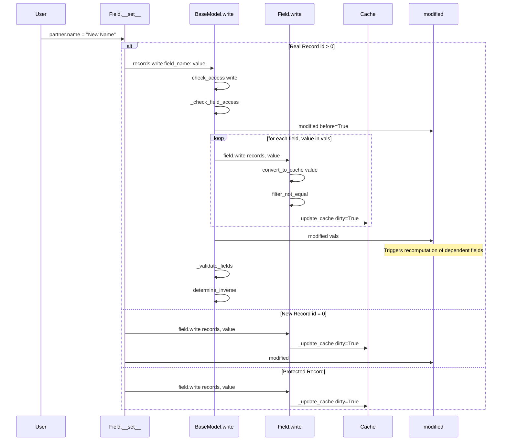
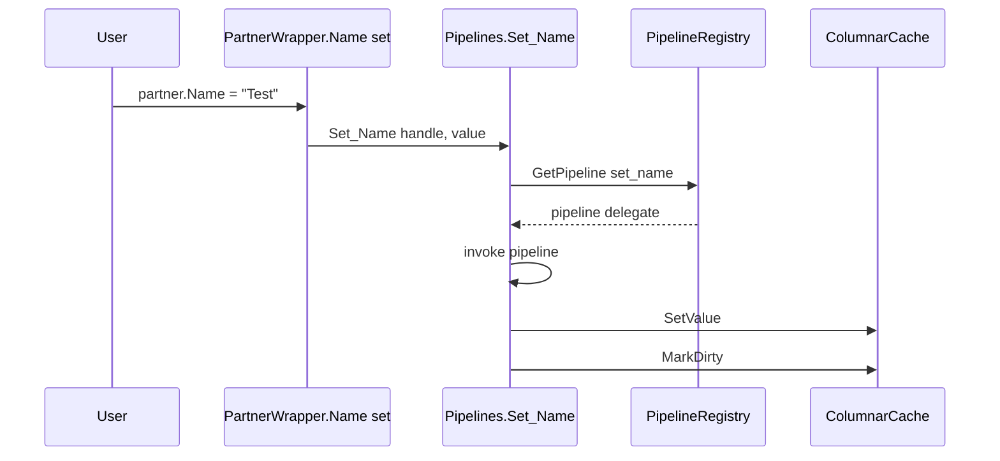
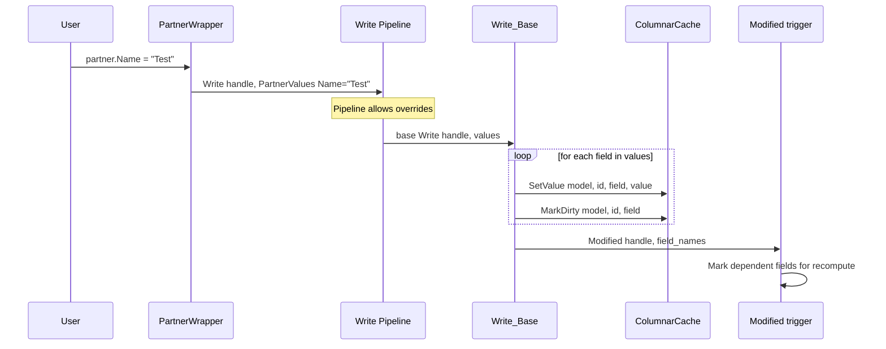
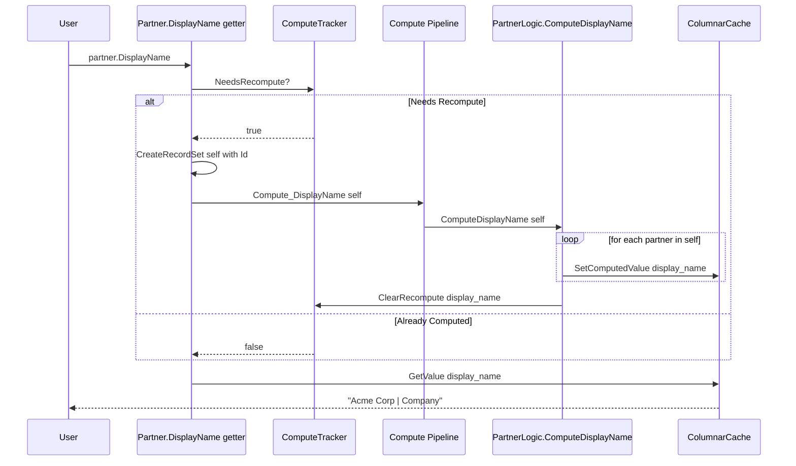
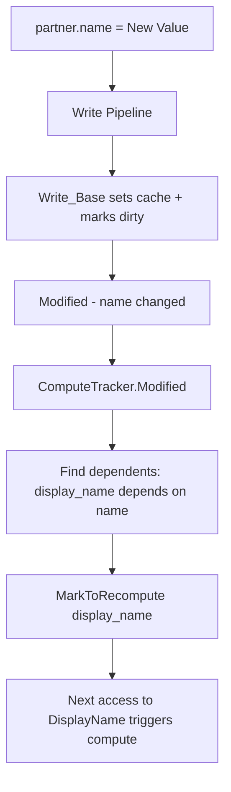
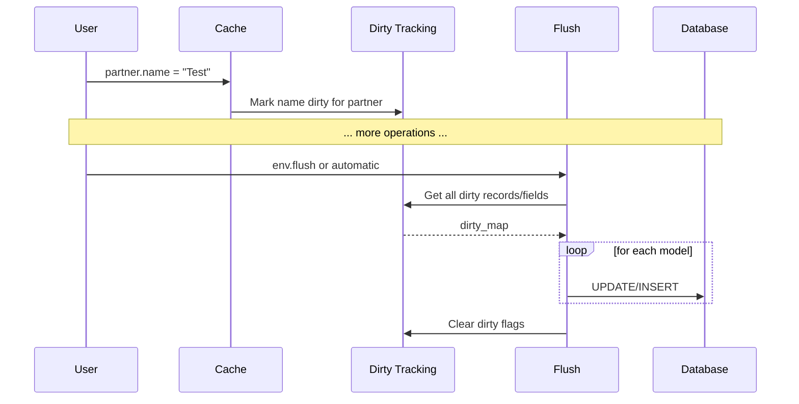

# Write/Create Pipeline Architecture

## Implementation Status: ⚠️ PHASE 1-5 COMPLETE, COMPUTED FIELDS PENDING

Phases 1-5 of this architecture have been implemented. The Write/Create pipeline patterns are working.

**Remaining Work:** Computed fields infrastructure needs updates to align with Odoo's batch pattern.


---

## 🔴 NEXT IMPLEMENTATION: Computed Fields (Batch Pattern)

The following changes are required to complete computed field support:

### Required Changes

| Task | File | Description |
|------|------|-------------|
| **1.1** | `OdooModelGenerator.cs` | Change compute method signature from `RecordHandle` to `RecordSet<T>` |
| **1.2** | `OdooEnvironment.cs` or new helper | Add `SetComputedValue<T>()` method for compute methods |
| **1.3** | `OdooModelGenerator.cs` | Update property getter to create single-record RecordSet for compute call |
| **2.1** | `addons/base/Models/Partner.cs` | Add computed `DisplayName` field with `[OdooCompute]` and `[OdooDepends]` |
| **2.2** | `addons/base/Logic/PartnerLogic.cs` | Add `ComputeDisplayName(RecordSet<T>)` method |
| **3.1** | `samples/Odoo.Demo/Examples/ComputedFieldDemo.cs` | Create demonstration |
| **3.2** | `samples/Odoo.Demo/Program.cs` | Add menu option 8 for computed field demo |

### Key Architecture Decisions

1. ✅ **Compute methods use `RecordSet<T>` (batch)** - Aligns with Odoo's `for record in self:` pattern
2. ✅ **Use `[OdooLogic]` for method registration** - Consistent with other pipeline methods
3. ✅ **Add `SetComputedValue` helper** - Bypasses Write pipeline to avoid recursion
4. ✅ **Interface attributes are sufficient** - `[OdooCompute]` and `[OdooDepends]` on property

## Executive Summary

This document describes our C# ORM's extensibility model, which is aligned with Odoo's patterns while maintaining our distinctive features: **type safety** and **high performance**.

The key change: **Property setters delegate to a unified `Write()` method with pipeline support**, rather than having individual pipelines per property setter.

---

## Part 1: How Odoo's ORM Works

### Sequence Diagram: Odoo Property Assignment



### Key Code from Odoo (fields.py lines 1802-1838)

```python
def __set__(self, records: BaseModel, value) -> None:
    """ set the value of field ``self`` on ``records`` """
    protected_ids = []
    new_ids = []
    other_ids = []
    for record_id in records._ids:
        if record_id in records.env._protected.get(self, ()):
            protected_ids.append(record_id)
        elif not record_id:
            new_ids.append(record_id)
        else:
            other_ids.append(record_id)

    if protected_ids:
        # records being computed: no business logic, no recomputation
        self.write(protected_records, value)

    if new_ids:
        # new records: no business logic
        with records.env.protecting(...):
            self.write(new_records, value)
            new_records.modified([self.name])

    if other_ids:
        # ⭐ KEY INSIGHT: Real records delegate to BaseModel.write()
        records = records.browse(other_ids)
        write_value = self.convert_to_write(value, records)
        records.write({self.name: write_value})  # <-- Single extensibility point!
```

### Sequence Diagram: Odoo Create

```mermaid
sequenceDiagram
    participant User
    participant Model as BaseModel.create
    participant Defaults as _add_missing_default_values
    participant Create as _create
    participant DB as Database
    participant Inverse as determine_inverse
    
    User->>Model: env.res_partner.create vals_list
    Model->>Model: check_access create
    Model->>Defaults: _add_missing_default_values
    Defaults-->>Model: vals_list with defaults
    Model->>Model: _prepare_create_values
    Model->>Model: classify fields stored/inverse/inherited
    
    loop for precompute fields
        Model->>Model: compute precompute values
    end
    
    Model->>Create: _create data_list
    Create->>DB: INSERT INTO table
    DB-->>Create: new record ids
    Create-->>Model: new records
    
    loop for inverse fields
        Model->>Inverse: field.determine_inverse
    end
    
    Model->>Model: _validate_fields
    Model-->>User: new records
```

### Key Takeaways from Odoo

1. **`write()` is THE extensibility point** - All property assignments for real records go through `BaseModel.write()`
2. **Modules override `write()`** to add business logic, not individual field setters
3. **`modified()` triggers recomputation** - After write, dependent fields are marked for recompute
4. **`create()` is a separate extensibility point** with similar override capability
5. **Lazy flush pattern** - Cache is marked dirty, actual SQL happens at flush time

---

## Part 2: Current C# Implementation Analysis

### Current Architecture (from OdooModelGenerator.cs)



### Current Generated Code (from OdooModelGenerator.cs lines 387-395, 459-481)

```csharp
// Wrapper property
public string Name
{
    get => PartnerPipelines.Get_Name(_handle);
    set => PartnerPipelines.Set_Name(_handle, value);  // ❌ Per-property pipeline
}

// Pipeline class
public static void Set_Name(RecordHandle handle, string value)
{
    var pipeline = handle.Env.GetPipeline<Action<RecordHandle, string>>(
        "res.partner", "set_name");  // ❌ One pipeline per field
    pipeline(handle, value);
}

public static void Set_Name_Base(RecordHandle handle, string value)
{
    handle.Env.Columns.SetValue(...);
    handle.Env.Columns.MarkDirty(...);
}
```

### Problems with Current Approach

| Problem | Description |
|---------|-------------|
| **N pipelines per model** | Each field has separate `get_*` and `set_*` pipelines |
| **No unified extensibility** | Cannot override `Write()` to intercept all field changes |
| **Misaligned with Odoo** | Modules can't easily add business logic on write |
| **No `modified()` equivalent** | No trigger for dependent field recomputation |
| **Missing `create()` pipeline** | Record creation has no extensibility point |

---

## Part 3: Proposed Architecture

### New Sequence Diagram: Property Assignment



### New Sequence Diagram: Record Creation

```mermaid
sequenceDiagram
    participant User
    participant Env as Environment
    participant Create as Create Pipeline
    participant Base as Create_Base
    participant IdGen as IdGenerator
    participant Cache as ColumnarCache
    participant Identity as IdentityMap
    
    User->>Env: env.Create PartnerValues Name="Test", IsCompany=true
    Env->>Create: Create Pipeline
    
    Note over Create: Pipeline allows overrides
    Create->>Base: base Create values
    
    Base->>IdGen: NextId res.partner
    IdGen-->>Base: newId
    Base->>Cache: SetValue for each field
    Base->>Identity: RegisterInIdentityMap
    Base-->>Create: new record
    Create-->>Env: new record
    Env-->>User: IPartner instance
```

### Proposed Generated Code

#### 1. Values Struct (already exists, keep it)

```csharp
public struct PartnerValues
{
    public string? Name { get; init; }
    public bool? IsCompany { get; init; }
    public int? ParentId { get; init; }
}
```

#### 2. New Wrapper Property Implementation

```csharp
public sealed class Partner : IPartnerBase, IRecordWrapper
{
    private readonly RecordHandle _handle;
    
    public string Name
    {
        // ⭐ Getter uses DIRECT cache read (no pipeline) - Odoo aligned
        get => _handle.Env.Columns.GetValue<string>(
            ModelSchema.Partner.ModelToken, _handle.Id, ModelSchema.Partner.Name);
        
        // ⭐ Setter delegates to Write() - single extensibility point
        set => PartnerPipelines.Write(_handle, new PartnerValues { Name = value });
    }
    
    public bool IsCompany
    {
        // Direct cache read
        get => _handle.Env.Columns.GetValue<bool>(
            ModelSchema.Partner.ModelToken, _handle.Id, ModelSchema.Partner.IsCompany);
        set => PartnerPipelines.Write(_handle, new PartnerValues { IsCompany = value });
    }
}
```

#### 3. New Pipelines Class

```csharp
public static class PartnerPipelines
{
    // ⭐ SINGLE Write pipeline for ALL field assignments
    public static void Write(RecordHandle handle, PartnerValues values)
    {
        var pipeline = handle.Env.GetPipeline<Action<RecordHandle, PartnerValues>>(
            "res.partner", "write");
        pipeline(handle, values);
    }
    
    // Base implementation - called at end of pipeline chain
    public static void Write_Base(RecordHandle handle, PartnerValues values)
    {
        var changedFields = new List<string>();
        
        if (values.Name is not null)
        {
            handle.Env.Columns.SetValue(
                ModelSchema.Partner.ModelToken, handle.Id,
                ModelSchema.Partner.Name, values.Name);
            handle.Env.Columns.MarkDirty(
                ModelSchema.Partner.ModelToken, handle.Id,
                ModelSchema.Partner.Name);
            changedFields.Add("name");
        }
        
        if (values.IsCompany is not null)
        {
            handle.Env.Columns.SetValue(
                ModelSchema.Partner.ModelToken, handle.Id,
                ModelSchema.Partner.IsCompany, values.IsCompany.Value);
            handle.Env.Columns.MarkDirty(
                ModelSchema.Partner.ModelToken, handle.Id,
                ModelSchema.Partner.IsCompany);
            changedFields.Add("is_company");
        }
        
        // Trigger recomputation of dependent fields
        if (changedFields.Count > 0)
        {
            PartnerPipelines.Modified(handle, changedFields);
        }
    }
    
    // ⭐ SINGLE Create pipeline
    public static IPartnerBase Create(IEnvironment env, PartnerValues values)
    {
        var pipeline = env.GetPipeline<Func<IEnvironment, PartnerValues, IPartnerBase>>(
            "res.partner", "create");
        return pipeline(env, values);
    }
    
    public static IPartnerBase Create_Base(IEnvironment env, PartnerValues values)
    {
        var newId = env.IdGenerator.NextId("res.partner");
        var handle = new RecordHandle(env, newId, ModelSchema.Partner.ModelToken);
        var record = new Partner(handle);
        
        // Register in identity map
        if (env is OdooEnvironment odooEnv)
            odooEnv.RegisterInIdentityMap(ModelSchema.Partner.ModelToken.Token, newId, record);
        
        // Write values
        Write_Base(handle, values);
        
        return record;
    }
    
    // ⭐ NO getter methods in Pipelines class - getters read directly from cache
    // Computed fields have their compute method registered, not getter pipelines
    
    // Modified - triggers dependent field recomputation
    public static void Modified(RecordHandle handle, IEnumerable<string> fieldNames)
    {
        // TODO: Implement field dependency graph traversal
        // Mark computed fields that depend on changed fields for recompute
    }
}
```

#### 4. How Modules Override Write

```csharp
// In Sale module
public static class PartnerSaleExtensions
{
    [OdooLogic("res.partner", "write")]
    public static void Write_SaleExtension(
        RecordHandle handle, 
        PartnerValues values,
        Action<RecordHandle, PartnerValues> super)  // super = next in pipeline
    {
        // Pre-write business logic
        if (values.IsCompany == true)
        {
            // Custom logic when becoming a company
            Console.WriteLine($"Partner {handle.Id} is now a company!");
        }
        
        // Call next in pipeline (eventually reaches Write_Base)
        super(handle, values);
        
        // Post-write business logic
        // e.g., update related sale orders
    }
}
```

---

## Part 4: Implementation Plan

### Phase 1: Core Infrastructure

1. **Add `Modified` support to cache** (track field dependencies)
2. **Add field dependency graph** to ModelSchema
3. **Update IPipelineBuilder** with standard method signatures

### Phase 2: Generator Changes

1. **Modify property getters** to use direct cache reads (no pipelines)
2. **Modify property setters** to delegate to `Write()`
3. **Generate unified `Write()` pipeline** per model
4. **Generate unified `Create()` pipeline** per model
5. **Generate `Modified()` method** for dependency tracking
6. **Generate computed field recompute triggers** in getters

### Phase 3: Module Registrar Updates

1. **Update ModuleRegistrar** to register `write` and `create` pipelines
2. **Support `super` parameter** for override chaining
3. **Handle pipeline priority** based on module dependencies

### Files to Modify

| File | Changes |
|------|---------|
| `OdooModelGenerator.cs` | Regenerate wrapper properties, add Write/Create pipelines |
| `IPipelineBuilder.cs` | Add standard delegate types for Write/Create |
| `PipelineRegistry.cs` | Optimize for fewer, heavier pipelines |
| `ModelSchema.cs` | Add field dependency graph |
| `IColumnarCache.cs` | Add Modified trigger support |

---

## Part 5: Benefits Summary

| Aspect | Current | Proposed |
|--------|---------|----------|
| **Pipelines per model** | N×2 (get+set per field) | 2 + C (write + create + computed) |
| **Override model** | Override individual setters | Override `Write()` - Odoo style |
| **Type safety** | ✅ Strong | ✅ Strong (Values struct) |
| **Performance** | Good | **Excellent** (direct cache reads) |
| **Odoo alignment** | Partial | Full |
| **Business logic hooks** | Scattered | Centralized in Write/Create |
| **Recomputation** | Manual | Automatic via Modified |

---

## Part 6: Getter Pipelines - Tradeoff Analysis

### The Question

Should property getters use pipelines (current approach) or directly read from cache (Odoo's approach)?

### Option A: Keep Getter Pipelines

```csharp
public string Name
{
    get => PartnerPipelines.Get_Name(_handle);  // Pipeline lookup + invoke
}
```

| Pros | Cons |
|------|------|
| Can intercept reads with overrides | Pipeline lookup overhead on EVERY read |
| Future flexibility for "on read" hooks | Not aligned with Odoo |
| Could support lazy computation override | N additional pipelines per model |
| | Adds complexity without clear benefit |

### Option B: Direct Cache Read (Recommended ✅)

```csharp
public string Name
{
    get => _handle.Env.Columns.GetValue<string>(
        ModelSchema.Partner.ModelToken, _handle.Id, ModelSchema.Partner.Name);
}
```

| Pros | Cons |
|------|------|
| **Best performance** - direct cache access | No read interception |
| **Aligned with Odoo** - no read override | Less flexible |
| Simpler architecture | |
| Computed fields still work (compute on cache miss) | |

### How Odoo Handles This

In Odoo's `Field.__get__()` (fields.py lines 1637-1800):
1. Check if value is in cache
2. If cache miss AND field is computed → call `compute_value()`
3. Return from cache

**Key insight**: Odoo has NO getter pipeline. Extensibility for computed fields is via the **compute method**, not the getter. The compute method can be overridden by inheriting modules.

### Decision: Direct Cache Reads ✅

We will **remove getter pipelines** and use direct cache access because:
1. **Performance**: Eliminates pipeline lookup on every property read
2. **Odoo alignment**: Matches Odoo's actual architecture
3. **Computed fields**: The compute method provides the extensibility hook, not the getter
4. **Simplicity**: Fewer moving parts, easier to understand

---

## Part 7: Computed Fields Architecture

### Odoo's Computed Field Pattern

```python
class Partner(models.Model):
    display_name = fields.Char(compute='_compute_display_name', store=True)
    
    @api.depends('name', 'is_company')
    def _compute_display_name(self):
        for record in self:
            if record.is_company:
                record.display_name = f"{record.name} | Company"
            else:
                record.display_name = record.name
```

**Key insight:** Odoo compute methods always iterate over `self` (a recordset), even when triggered for a single record.

### Our C# Equivalent (Batch Pattern)

```csharp
// === INTERFACE: Define the computed field ===
[OdooModel("res.partner")]
public interface IPartnerBase : IOdooRecord
{
    [OdooField("name")]
    string Name { get; set; }
    
    [OdooField("is_company")]
    bool IsCompany { get; set; }
    
    [OdooField("display_name")]
    [OdooCompute("_compute_display_name")]  // Method name that computes this field
    [OdooDepends("name", "is_company")]      // Fields that trigger recomputation
    string DisplayName { get; }              // Read-only computed field
}

// === LOGIC: Implement the compute method ===
public static class PartnerLogic
{
    /// <summary>
    /// Compute display_name for all partners in the recordset.
    /// Uses batch pattern: iterates over self like Odoo's `for record in self:`.
    /// </summary>
    [OdooLogic("res.partner", "_compute_display_name")]
    public static void ComputeDisplayName(RecordSet<IPartnerBase> self)
    {
        foreach (var partner in self)
        {
            var name = partner.Name ?? "";
            var displayName = partner.IsCompany
                ? $"{name} | Company"
                : name;
            
            // SetComputedValue bypasses Write pipeline to avoid infinite recursion
            partner.Env.SetComputedValue(
                ModelSchema.Partner.ModelToken,
                partner.Id,
                ModelSchema.Partner.DisplayName,
                displayName);
        }
    }
}
```

### SetComputedValue Helper Method

**Purpose:** Allow compute methods to set field values without triggering the Write pipeline (which would cause infinite loops).

```csharp
// In OdooEnvironment or as extension method
public static void SetComputedValue<T>(
    this IEnvironment env,
    ModelHandle model,
    int recordId,
    FieldHandle field,
    T value)
{
    // Direct cache write - no pipeline, no Modified trigger
    env.Columns.SetValue(model, recordId, field, value);
    
    // Clear the recompute flag for this field
    if (env is OdooEnvironment odooEnv)
    {
        odooEnv.ComputeTracker.ClearRecompute(model, recordId, field);
    }
}
```

### Generated Code for Computed Fields

```csharp
// Generated wrapper class
public sealed class Partner : IPartnerBase
{
    private readonly RecordHandle _handle;
    
    // Regular stored field - direct cache access
    public string Name
    {
        get => Env.Columns.GetValue<string>(
            ModelSchema.Partner.ModelToken, Id, ModelSchema.Partner.Name);
        set
        {
            var vals = new Dictionary<string, object?> { { "name", value } };
            PartnerPipelines.Write(_handle, vals);
        }
    }
    
    // Computed field - checks NeedsRecompute, triggers compute if needed
    public string DisplayName
    {
        get
        {
            // Check if recomputation is needed
            if (Env is OdooEnvironment odooEnv &&
                odooEnv.ComputeTracker.NeedsRecompute(
                    ModelSchema.Partner.ModelToken, Id, ModelSchema.Partner.DisplayName))
            {
                // Create single-record RecordSet for batch-compatible compute
                var recordSet = Env.CreateRecordSet<IPartnerBase>(new[] { Id });
                
                // Call the compute method via pipeline
                PartnerPipelines.Compute_DisplayName(recordSet);
            }
            
            // Return value from cache
            return Env.Columns.GetValue<string>(
                ModelSchema.Partner.ModelToken, Id, ModelSchema.Partner.DisplayName);
        }
        // No setter - computed fields are read-only
    }
}

// Generated pipeline class
public static class PartnerPipelines
{
    /// <summary>
    /// Trigger computation of DisplayName for the given records.
    /// Calls the registered compute method via pipeline.
    /// </summary>
    public static void Compute_DisplayName(RecordSet<IPartnerBase> self)
    {
        var pipeline = self.Env.GetPipeline<Action<RecordSet<IPartnerBase>>>(
            "res.partner", "_compute_display_name");
        pipeline(self);
    }
    
    /// <summary>
    /// Base compute implementation - no-op, actual logic provided by module.
    /// </summary>
    public static void Compute_DisplayName_Base(RecordSet<IPartnerBase> self)
    {
        // No-op base - module provides actual computation via [OdooLogic]
    }
}
```

### Sequence Diagram: Computed Field Access



### Dependency Graph: Modified Triggers Recompute



---

## Part 8: Batch Write & RecordSet Operations

### Single vs Batch Write

```csharp
// Single record write (property setter)
partner.Name = "Test";
// → Pipelines.Write(handle, new Values { Name = "Test" })

// Batch write (RecordSet method)
partners.Write(new PartnerValues { IsActive = false });
// → Pipelines.WriteMany(handles[], new Values { IsActive = false })
```

### Generated RecordSet Extensions

```csharp
public static class PartnerRecordSetExtensions
{
    /// <summary>
    /// Write values to all records in the set.
    /// Like Odoo's records.write(vals).
    /// </summary>
    public static void Write(this RecordSet<IPartnerBase> self, PartnerValues values)
    {
        var pipeline = self.Env.GetPipeline<Action<RecordSet<IPartnerBase>, PartnerValues>>(
            "res.partner", "write");
        pipeline(self, values);
    }
    
    public static void Write_Base(RecordSet<IPartnerBase> self, PartnerValues values)
    {
        var changedFields = new List<string>();
        
        // Batch update cache for all records
        if (values.Name is not null)
        {
            var names = new string[self.Ids.Length];
            Array.Fill(names, values.Name);
            
            self.Env.Columns.SetColumnValues(
                ModelSchema.Partner.ModelToken,
                self.Ids,
                ModelSchema.Partner.Name,
                names.AsSpan());
                
            foreach (var id in self.Ids)
                self.Env.Columns.MarkDirty(ModelSchema.Partner.ModelToken, id, ModelSchema.Partner.Name);
            
            changedFields.Add("name");
        }
        
        // Trigger modified for all records
        if (changedFields.Count > 0)
            Modified(self, changedFields);
    }
}
```

---

## Part 9: Flush Pattern

### Odoo's Flush Architecture



### Our Flush Implementation

```csharp
public interface IEnvironment
{
    // ... existing ...
    
    /// <summary>
    /// Flush all pending changes to database.
    /// </summary>
    void Flush();
    
    /// <summary>
    /// Flush changes for specific model.
    /// </summary>
    void FlushModel(string modelName);
    
    /// <summary>
    /// Flush changes for specific fields.
    /// </summary>
    void FlushFields(string modelName, params string[] fieldNames);
}

public class OdooEnvironment : IEnvironment
{
    private readonly DirtyTracker _dirtyTracker = new();
    
    public void Flush()
    {
        // Get all dirty records grouped by model
        var dirtyByModel = _dirtyTracker.GetAllDirty();
        
        foreach (var (modelName, recordFields) in dirtyByModel)
        {
            // Generate UPDATE statements for each record
            foreach (var (recordId, dirtyFields) in recordFields)
            {
                var values = BuildValuesFromCache(modelName, recordId, dirtyFields);
                // Execute database update
                _database.Update(modelName, recordId, values);
            }
        }
        
        _dirtyTracker.ClearAll();
    }
}
```

---

## Part 10: Dual API - Type-Safe + Dynamic

### Architecture Layers

```
┌─────────────────────────────────────────────────────┐
│  Python/Dynamic Layer - Dictionary-based API        │
│  env["res.partner"].Write(new { name = "Test" })    │
├─────────────────────────────────────────────────────┤
│  Type-Safe Layer - Values struct                    │
│  partner.Write(new PartnerValues { Name = "Test" }) │
├─────────────────────────────────────────────────────┤
│  Core Layer - Direct cache operations               │
│  cache.SetValue(model, id, field, value)            │
└─────────────────────────────────────────────────────┘
```

### Dynamic API Implementation

```csharp
/// <summary>
/// Dynamic model proxy for Pythonic API.
/// Converts anonymous objects/dictionaries to strongly-typed Values.
/// </summary>
public class ModelProxy
{
    public IOdooRecord Create(object values)
    {
        // Convert anonymous object to Dictionary<string, object?>
        var dict = ConvertToDict(values);
        
        // Use reflection to create Values struct
        var valuesStruct = CreateValuesStruct(_schema.ModelName, dict);
        
        // Call the typed Create pipeline
        return InvokeCreatePipeline(valuesStruct);
    }
    
    public void Write(int[] ids, object values)
    {
        var dict = ConvertToDict(values);
        var valuesStruct = CreateValuesStruct(_schema.ModelName, dict);
        InvokeWritePipeline(ids, valuesStruct);
    }
    
    // Python integration
    public void WriteFromPython(int[] ids, Dictionary<string, object?> pyDict)
    {
        var valuesStruct = CreateValuesStruct(_schema.ModelName, pyDict);
        InvokeWritePipeline(ids, valuesStruct);
    }
}
```

---

## Part 11: Updated Implementation Plan

### Phase 1: Core Infrastructure Changes

| Task | Files | Description |
|------|-------|-------------|
| 1.1 | `IColumnarCache.cs` | Add flush-related methods |
| 1.2 | `DirtyTracker.cs` (new) | Centralized dirty tracking |
| 1.3 | `ComputeTracker.cs` (new) | Track fields needing recomputation |
| 1.4 | `ModelSchema.cs` | Add field dependency graph |
| 1.5 | `OdooEnvironment.cs` | Add Flush() method |

### Phase 2: Attribute Definitions

| Task | Files | Description |
|------|-------|-------------|
| 2.1 | `OdooFramework.cs` | Add `[OdooCompute]` attribute |
| 2.2 | `OdooFramework.cs` | Add `[OdooDepends]` attribute |
| 2.3 | `OdooFramework.cs` | Add `[OdooInverse]` attribute |

### Phase 3: Source Generator Rewrite

| Task | Description |
|------|-------------|
| 3.1 | Remove per-field getter pipelines |
| 3.2 | Generate direct cache read for getters |
| 3.3 | Generate unified `Write()` pipeline (single + batch) |
| 3.4 | Generate unified `Create()` pipeline |
| 3.5 | Generate `Modified()` trigger |
| 3.6 | Generate computed field handling |
| 3.7 | Generate RecordSet extension methods |

### Phase 4: Module Registrar Updates

| Task | Description |
|------|-------------|
| 4.1 | Register `write` and `create` pipelines |
| 4.2 | Register compute methods |
| 4.3 | Build dependency graph at startup |

### Phase 5: Python Integration

| Task | Description |
|------|-------------|
| 5.1 | Enhance `ModelProxy` with dynamic Write/Create |
| 5.2 | Dictionary ↔ Values struct conversion |

---

## Summary: Final Architecture

### Pipeline Count Comparison

| Model with N fields | Before | After |
|---------------------|--------|-------|
| Getter pipelines | N | 0 |
| Setter pipelines | N | 0 |
| Write pipeline | 0 | 1 |
| Create pipeline | 0 | 1 |
| Compute pipelines | 0 | C (count of computed fields) |
| **Total** | **2N** | **2 + C** |

### Key Design Decisions

1. ✅ **No getter pipelines** - Direct cache reads for performance
2. ✅ **Unified Write pipeline** - Single extensibility point for all field changes
3. ✅ **Batch write support** - `RecordSet.Write(values)`
4. ✅ **Computed fields** - `[OdooCompute]` + `[OdooDepends]` attributes
5. ✅ **Flush pattern** - Dirty tracking + explicit flush
6. ✅ **Dual API** - Type-safe Values struct + dynamic Dictionary layer

---

## Part 12: Implementation Details

### Files Created

| File | Purpose |
|------|---------|
| [`src/Odoo.Core/DirtyTracker.cs`](../src/Odoo.Core/DirtyTracker.cs) | Centralized dirty tracking for field modifications |
| [`src/Odoo.Core/ComputeTracker.cs`](../src/Odoo.Core/ComputeTracker.cs) | Tracks computed fields needing recomputation with dependency graph |
| [`src/Odoo.Core/Attributes/ComputedFieldAttributes.cs`](../src/Odoo.Core/Attributes/ComputedFieldAttributes.cs) | All computed field attributes |

### Files Modified

| File | Changes |
|------|---------|
| [`FieldSchema.cs`](../src/Odoo.Core/Modules/FieldSchema.cs) | Added computed field properties: `IsComputed`, `ComputeMethodName`, `Dependencies`, etc. |
| [`ModelSchema.cs`](../src/Odoo.Core/Modules/ModelSchema.cs) | Added field dependency graph and computed field registration |
| [`IColumnarCache.cs`](../src/Odoo.Core/IColumnarCache.cs) | Added flush-related methods: `GetDirtyRecords()`, `GetDirtyModels()`, etc. |
| [`ColumnarValueCache.cs`](../src/Odoo.Core/ColumnarValueCache.cs) | Implemented new flush-related interface methods |
| [`OdooEnvironment.cs`](../src/Odoo.Core/OdooEnvironment.cs) | Added `DirtyTracker`, `ComputeTracker`, `Flush()`, `Modified()` methods |
| [`OdooModelGenerator.cs`](../src/Odoo.SourceGenerator/OdooModelGenerator.cs) | Complete rewrite for Odoo-aligned pattern |

### Generated Code Examples

The source generator now produces Odoo-aligned code:

#### Wrapper Property (Direct Cache Read + Write Pipeline)

```csharp
// Generated in {Model}.g.cs
public sealed class Partner : IPartnerBase, IRecordWrapper
{
    private readonly RecordHandle _handle;

    public string Name
    {
        // GETTER: Direct cache read (no pipeline overhead) - Odoo aligned
        get => Env.Columns.GetValue<string>(
            ModelSchema.Partner.ModelToken, Id, ModelSchema.Partner.Name);
        
        // SETTER: Delegate to unified Write() pipeline - Odoo aligned
        set
        {
            var vals = new Dictionary<string, object?> { { "name", value } };
            PartnerPipelines.Write(_handle, vals);
        }
    }
}
```

#### Unified Write Pipeline

```csharp
// Generated in {Model}Pipelines.g.cs
public static class PartnerPipelines
{
    /// <summary>
    /// Unified Write pipeline - THE single extensibility point for all field assignments.
    /// Override this to add validation, onchange logic, or business rules.
    /// </summary>
    public static void Write(RecordHandle handle, Dictionary<string, object?> vals)
    {
        var pipeline = handle.Env.GetPipeline<Action<RecordHandle, Dictionary<string, object?>>>(
            "res.partner", "write");
        pipeline(handle, vals);
    }
    
    /// <summary>
    /// Base Write implementation - applies values to cache and marks dirty.
    /// </summary>
    public static void Write_Base(RecordHandle handle, Dictionary<string, object?> vals)
    {
        if (vals.TryGetValue("name", out var nameVal) && nameVal is string nameTyped)
        {
            handle.Env.Columns.SetValue(
                ModelSchema.Partner.ModelToken, handle.Id,
                ModelSchema.Partner.Name, nameTyped);
            handle.Env.Columns.MarkDirty(
                ModelSchema.Partner.ModelToken, handle.Id,
                ModelSchema.Partner.Name);
        }
        // ... other fields ...
    }
}
```

#### Unified Create Pipeline

```csharp
// Generated in {Model}Pipelines.g.cs
public static Partner Create(IEnvironment env, Dictionary<string, object?> vals)
{
    var pipeline = env.GetPipeline<Func<IEnvironment, Dictionary<string, object?>, Partner>>(
        "res.partner", "create");
    return pipeline(env, vals);
}

public static Partner Create_Base(IEnvironment env, Dictionary<string, object?> vals)
{
    var newId = env.IdGenerator.NextId("res.partner");
    var modelToken = ModelSchema.Partner.ModelToken;
    var handle = new RecordHandle(env, newId, modelToken);
    var record = new Partner(handle);
    
    // Register in identity map for reference equality
    if (env is OdooEnvironment odooEnv)
    {
        odooEnv.RegisterInIdentityMap(modelToken.Token, newId, record);
    }
    
    // Apply initial values via Write_Base
    Write_Base(handle, vals);
    
    return record;
}
```

---

## Part 13: Usage Examples

### Example 1: Basic Property Assignment

```csharp
// Create environment
var env = new OdooEnvironment(userId: 1, modelRegistry: registry);

// Get a record
var partner = env.GetRecord<IPartnerBase>("res.partner", 1);

// Property assignment goes through Write() pipeline
partner.Name = "Acme Corp";  // → PartnerPipelines.Write(handle, {"name": "Acme Corp"})

// Explicit flush to persist to database
env.Flush();
```

### Example 2: Creating Records

```csharp
// Type-safe creation with Values struct
var newPartner = env.Create(new PartnerValues
{
    Name = "New Partner",
    IsCompany = true
});

// Or dynamic creation for Python integration
var vals = new Dictionary<string, object?>
{
    { "name", "Dynamic Partner" },
    { "is_company", false }
};
var dynamicPartner = PartnerPipelines.Create(env, vals);
```

### Example 3: Overriding Write in a Module

```csharp
// In your module's logic class
public static class PartnerSaleExtensions
{
    /// <summary>
    /// Sale module extension for Partner write.
    /// Adds validation when partner becomes a company.
    /// </summary>
    [OdooLogic("res.partner", "write")]
    public static void Write_SaleValidation(
        RecordHandle handle,
        Dictionary<string, object?> vals,
        Action<RecordHandle, Dictionary<string, object?>> super)  // super = next in pipeline
    {
        // PRE-WRITE: Validation and business logic
        if (vals.TryGetValue("is_company", out var isCompanyVal) &&
            isCompanyVal is true)
        {
            // Validate company has required fields
            var existingName = handle.Env.Columns.GetValue<string>(
                ModelSchema.Partner.ModelToken, handle.Id, ModelSchema.Partner.Name);
            
            if (string.IsNullOrWhiteSpace(existingName) && !vals.ContainsKey("name"))
            {
                throw new ValidationException("Company must have a name");
            }
            
            Console.WriteLine($"Partner {handle.Id} is becoming a company!");
        }
        
        // Call next in pipeline (eventually reaches Write_Base)
        super(handle, vals);
        
        // POST-WRITE: Side effects
        if (vals.ContainsKey("is_company"))
        {
            // Update related sale orders, send notifications, etc.
            UpdateRelatedSaleOrders(handle);
        }
    }
}
```

### Example 4: Overriding Create in a Module

```csharp
public static class PartnerAccountExtensions
{
    /// <summary>
    /// Account module extension for Partner create.
    /// Auto-creates receivable/payable accounts for new partners.
    /// </summary>
    [OdooLogic("res.partner", "create")]
    public static Partner Create_AccountDefaults(
        IEnvironment env,
        Dictionary<string, object?> vals,
        Func<IEnvironment, Dictionary<string, object?>, Partner> super)
    {
        // PRE-CREATE: Add default values
        if (!vals.ContainsKey("property_account_receivable_id"))
        {
            vals["property_account_receivable_id"] = GetDefaultReceivableAccount(env);
        }
        
        // Call next in pipeline
        var partner = super(env, vals);
        
        // POST-CREATE: Create related records
        CreatePartnerAccountingEntries(partner);
        
        return partner;
    }
}
```

### Example 5: Computed Fields (DisplayName)

```csharp
// === INTERFACE (addons/base/Models/Partner.cs) ===
[OdooModel("res.partner")]
public interface IPartnerBase : IOdooRecord
{
    [OdooField("name")]
    string Name { get; set; }
    
    [OdooField("is_company")]
    bool IsCompany { get; set; }
    
    [OdooField("display_name")]
    [OdooCompute("_compute_display_name")]
    [OdooDepends("name", "is_company")]
    string DisplayName { get; }  // Computed - read-only
}

// === COMPUTE METHOD (addons/base/Logic/PartnerLogic.cs) ===
public static class PartnerLogic
{
    /// <summary>
    /// Compute display_name for all partners in the recordset.
    /// Pattern: Batch iteration like Odoo's `for record in self:`.
    /// </summary>
    [OdooLogic("res.partner", "_compute_display_name")]
    public static void ComputeDisplayName(RecordSet<IPartnerBase> self)
    {
        foreach (var partner in self)
        {
            var name = partner.Name ?? "";
            var displayName = partner.IsCompany
                ? $"{name} | Company"
                : name;
            
            // SetComputedValue bypasses Write pipeline
            partner.Env.SetComputedValue(
                ModelSchema.Partner.ModelToken,
                partner.Id,
                ModelSchema.Partner.DisplayName,
                displayName);
        }
    }
}
```

**Key Points:**
- `[OdooCompute("_compute_display_name")]` - references the pipeline method name
- `[OdooDepends("name", "is_company")]` - triggers recomputation when these fields change
- `RecordSet<IPartnerBase> self` - batch pattern, even for single records
- `SetComputedValue` - direct cache write without triggering Write pipeline

### Example 6: Flush and Dirty Tracking

```csharp
// Multiple modifications
partner1.Name = "Updated 1";  // Marked dirty
partner2.Name = "Updated 2";  // Marked dirty
partner2.IsCompany = true;    // Marked dirty

// Check what's dirty
var dirtyFields = env.DirtyTracker.GetDirtyFields("res.partner", partner2.Id);
// Returns: ["name", "is_company"]

// Flush all pending changes to database
env.Flush();  // Executes UPDATE statements for all dirty records

// Or flush specific model
env.FlushModel("res.partner");
```

### Example 7: Module Registration

```csharp
// Generated ModuleRegistrar for your module
public class ModuleRegistrar : IModuleRegistrar
{
    public void RegisterPipelines(IPipelineBuilder builder)
    {
        // Register base Write/Create pipelines
        builder.RegisterBase("res.partner", "write",
            (Action<RecordHandle, Dictionary<string, object?>>)PartnerPipelines.Write_Base);
        builder.RegisterBase("res.partner", "create",
            (Func<IEnvironment, Dictionary<string, object?>, Partner>)PartnerPipelines.Create_Base);
        
        // Overrides are registered separately with priority
        builder.RegisterOverride("res.partner", "write", 10,
            (Action<RecordHandle, Dictionary<string, object?>, Action<RecordHandle, Dictionary<string, object?>>>)
            PartnerSaleExtensions.Write_SaleValidation);
    }
    
    public void RegisterFactories(ModelRegistry modelRegistry)
    {
        modelRegistry.RegisterFactory("res.partner",
            (env, id) => new Partner(new RecordHandle(env, id, ModelSchema.Partner.ModelToken)));
    }
}
```

---

## Part 14: Comparison with Odoo

| Aspect | Odoo (Python) | Our C# Implementation |
|--------|---------------|----------------------|
| **Property getter** | `Field.__get__` → cache | Direct cache read |
| **Property setter** | `Field.__set__` → `write()` | Setter → `Write()` pipeline |
| **Write extensibility** | Override `write()` method | Pipeline with `[OdooLogic]` |
| **Create extensibility** | Override `create()` method | Pipeline with `[OdooLogic]` |
| **Computed fields** | `@api.depends` decorator | `[OdooDepends]` attribute |
| **Inverse methods** | `inverse=` parameter | `[OdooInverse]` attribute |
| **Dirty tracking** | `env.cache._dirty` | `DirtyTracker` class |
| **Flush pattern** | `env.flush()` | `env.Flush()` method |
| **Type safety** | ❌ Dynamic | ✅ Strong typing |
| **Performance** | Interpreted | ✅ Compiled + optimized |

---

## Part 15: Available Attributes

All attributes are defined in [`ComputedFieldAttributes.cs`](../src/Odoo.Core/Attributes/ComputedFieldAttributes.cs):

| Attribute | Purpose | Odoo Equivalent |
|-----------|---------|-----------------|
| `[OdooCompute("method")]` | Mark field as computed | `compute='method'` |
| `[OdooDepends("field1", "field2")]` | Declare compute dependencies | `@api.depends(...)` |
| `[OdooInverse("method")]` | Method to update source fields | `inverse='method'` |
| `[OdooDefault("method")]` | Default value method | `default=lambda self: ...` |
| `[OdooRelated("path.to.field")]` | Related field shortcut | `related='field.path'` |
| `[OdooRequired]` | Field is required | `required=True` |
| `[OdooTracking]` | Track field changes | `tracking=True` |
| `[OdooConstrains("field1", "field2")]` | Validation constraint | `@api.constrains(...)` |
| `[OdooOnchange("field1", "field2")]` | Onchange handler | `@api.onchange(...)` |
| `[OdooOverride("model", "method")]` | Override existing pipeline | Inheritance |

---

## Part 16: Architecture Diagram

```
┌─────────────────────────────────────────────────────────────────────────┐
│                        User Code / Application                          │
├─────────────────────────────────────────────────────────────────────────┤
│  partner.Name = "Test"                env.Create(new PartnerValues{...})│
└────────────────┬────────────────────────────────────┬───────────────────┘
                 │                                    │
                 ▼                                    ▼
┌─────────────────────────────────────────────────────────────────────────┐
│                    Generated Wrapper Classes                            │
│  ┌─────────────────────────────┐    ┌─────────────────────────────┐    │
│  │ Partner.Name setter         │    │ env.Create() extension      │    │
│  │ → Pipelines.Write(vals)     │    │ → Pipelines.Create(vals)    │    │
│  └─────────────┬───────────────┘    └─────────────┬───────────────┘    │
└────────────────┼────────────────────────────────────┼───────────────────┘
                 │                                    │
                 ▼                                    ▼
┌─────────────────────────────────────────────────────────────────────────┐
│                      Pipeline Registry                                  │
│  ┌─────────────────────────────────────────────────────────────────┐   │
│  │  "res.partner" + "write" → [Override1, Override2, Write_Base]   │   │
│  │  "res.partner" + "create" → [Override1, Create_Base]            │   │
│  └─────────────────────────────────────────────────────────────────┘   │
└────────────────┬────────────────────────────────────┬───────────────────┘
                 │                                    │
                 ▼                                    ▼
┌─────────────────────────────────────────────────────────────────────────┐
│                     Module Overrides (if any)                           │
│  ┌─────────────────────────────────────────────────────────────────┐   │
│  │  Sale.Write_SaleValidation(handle, vals, super)                 │   │
│  │  Account.Create_AccountDefaults(env, vals, super)               │   │
│  └────────────────────────────┬────────────────────────────────────┘   │
└───────────────────────────────┼─────────────────────────────────────────┘
                                │ calls super()
                                ▼
┌─────────────────────────────────────────────────────────────────────────┐
│                      Base Implementation                                │
│  ┌─────────────────────────────────────────────────────────────────┐   │
│  │  Write_Base: cache.SetValue() + cache.MarkDirty()               │   │
│  │  Create_Base: IdGen.NextId() + new Record() + Write_Base()      │   │
│  └────────────────────────────┬────────────────────────────────────┘   │
└───────────────────────────────┼─────────────────────────────────────────┘
                                │
                                ▼
┌─────────────────────────────────────────────────────────────────────────┐
│                      Columnar Cache                                     │
│  ┌─────────────────────────────────────────────────────────────────┐   │
│  │  Model → Field → [id1: value1, id2: value2, ...]                │   │
│  │  Dirty tracking: (Model, Id) → Set<FieldToken>                  │   │
│  └─────────────────────────────────────────────────────────────────┘   │
└───────────────────────────────┬─────────────────────────────────────────┘
                                │ env.Flush()
                                ▼
┌─────────────────────────────────────────────────────────────────────────┐
│                        Database                                         │
│  ┌─────────────────────────────────────────────────────────────────┐   │
│  │  UPDATE res_partner SET name = ?, is_company = ? WHERE id = ?   │   │
│  └─────────────────────────────────────────────────────────────────┘   │
└─────────────────────────────────────────────────────────────────────────┘
```

---

## Conclusion

This architecture successfully aligns our C# ORM with Odoo's extensibility patterns while maintaining our key advantages:

1. **Type Safety**: Strongly-typed Values structs, interfaces, and generics throughout
2. **Performance**: Direct cache reads, compiled pipelines, columnar data storage
3. **Odoo Compatibility**: Same override patterns (`write()`, `create()`) as Odoo
4. **Module Extensibility**: Easy to add business logic via `[OdooLogic]` attributes
5. **Python Integration**: Dictionary-based API for dynamic access and Python bridge